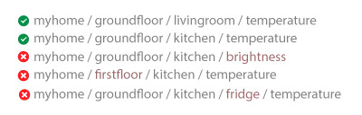
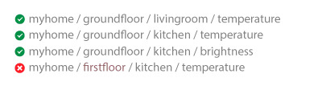
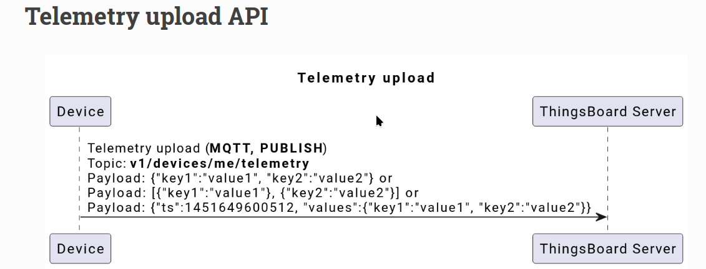
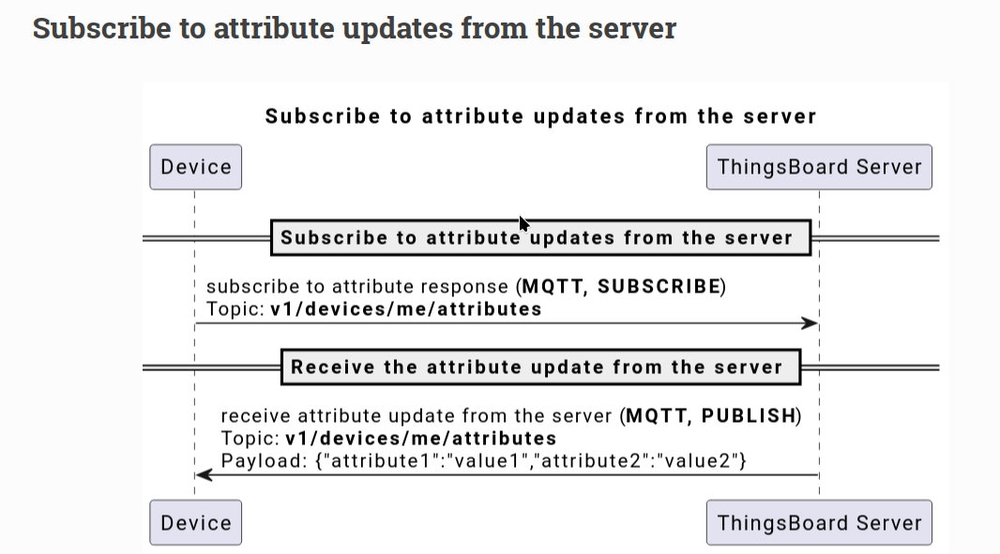
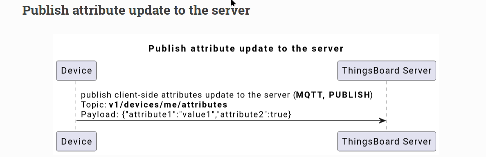
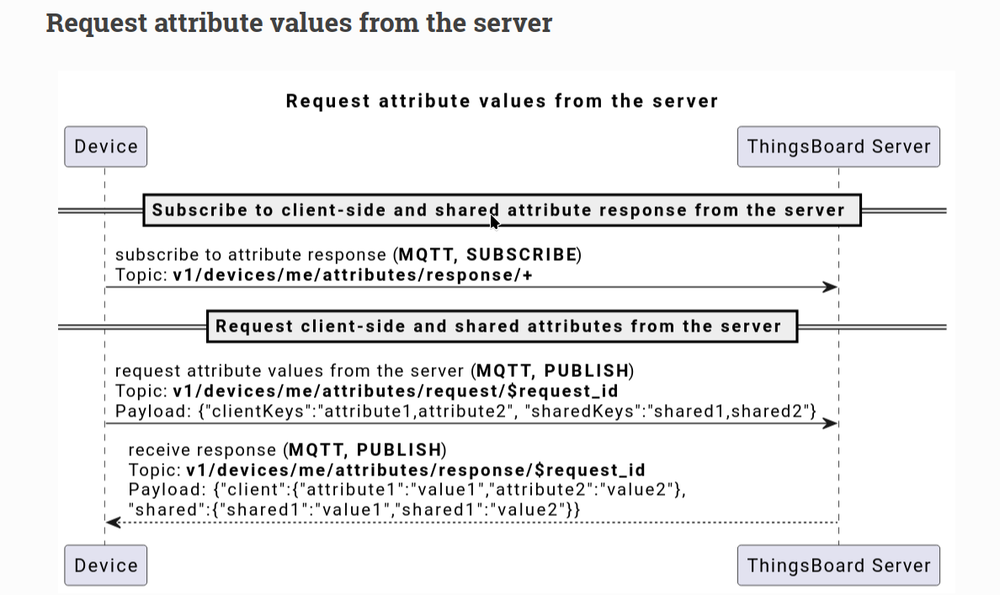
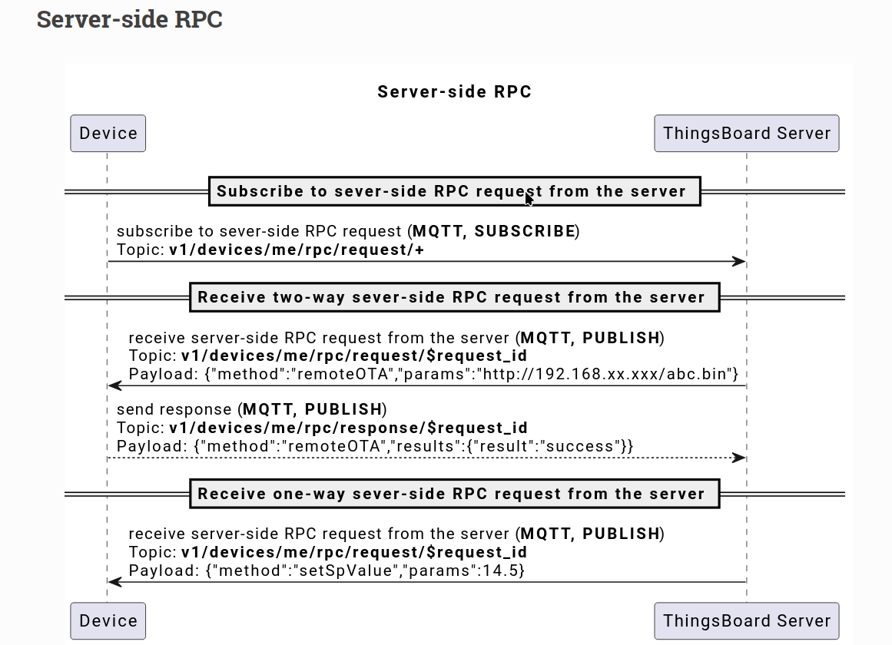

# 1 Summary Thingsboard Topic

In ThingsBoard, MQTT topics allow devices to communicate by publishing telemetry data, receiving RPC commands, and updating shared attributes. When using an ESP32 with ThingsBoard over MQTT, the main topics typically include:

## Connct MQTT in thingsboard

We will use access token device credentials in this article and they will be referred to later as $ACCESS_TOKEN. The application needs to send MQTT CONNECT message with username that contains $ACCESS_TOKEN. Possible return codes and their reasons during connect sequence:

    0x00 Connected - Successfully connected to ThingsBoard MQTT server.

    0x04 Connection Refused, bad user name or password - Username is empty.

    0x05 Connection Refused, not authorized - Username contains invalid $ACCESS_TOKEN.

## What is data json format?

Key-value format

By default, ThingsBoard supports key-value content in JSON. Key is always a string, while value can be either string, boolean, double, long or JSON. For example:

```json
{
  "stringKey": "value1",
  "booleanKey": true,
  "doubleKey": 42.0,
  "longKey": 73,
  "jsonKey": {
    "someNumber": 42,
    "someArray": [1, 2, 3],
    "someNestedObject": { "key": "value" }
  }
}
```

## MQTT Topic pettern

In MQTT, Topic refers to a UTF-8 string that filters messages for a connected client. A topic consists of one or more levels separated by a forward slash (topic level separator)


## MQTT WildCards single-level , multi-level

The single-level wildcard is represented by the plus symbol (+) and allows the replacement of a single topic level. By subscribing to a topic with a single-level wildcard, any topic that contains an arbitrary string in place of the wildcard will be matched.


Single Level: myhome/groundfloor/+/temperature



Multi Level:


it receives all messages of a topic that begins with the pattern before the wildcard character, regardless of the length or depth of the topic.



# Welcome to IoT mqtt topic in Thingsboard

**1 Telemetry Data Topic:**

```
Topic: v1/devices/me/telemetry
```

Purpose: ESP32 devices publish sensor readings or state information as telemetry data here. This data can include temperature, humidity, or custom metrics that ThingsBoard will visualize or process further.



**2 Attributes:**

```
Topic (Client-side Attributes): v1/devices/me/attributes
```

Purpose: ESP32 can publish its static or dynamic attributes, like device location, firmware version, or any state configuration, to ThingsBoard. This helps keep ThingsBoard updated with device-specific info.





```
Topic (Shared Attributes): v1/devices/me/attributes/request
```

Purpose: ESP32 can request shared attributes that ThingsBoard has defined, which can include configuration settings. These are useful when the device needs configuration data set from ThingsBoard's dashboard.



**3 RPC Commands:**

```
Topic (RPC Request): v1/devices/me/rpc/request/{requestId}
```

Purpose: ESP32 can receive remote commands from ThingsBoard, allowing control actions (like turning on a relay) triggered from the ThingsBoard dashboard. Each RPC request has a unique requestId to track responses.

```
Topic (RPC Response): v1/devices/me/rpc/response/{requestId}
```

Purpose: ESP32 uses this to respond back with success or status information once an RPC command is completed.



Example code: muict_lab1.ino

```cpp
#include <WiFi.h>
#include <PubSubClient.h>

const char* ssid = "YOUR_WIFI_SSID";
const char* password = "YOUR_WIFI_PASSWORD";
const char* mqtt_server = "YOUR_THINGSBOARD_SERVER_IP";
const char* access_token = "YOUR_DEVICE_ACCESS_TOKEN"; // Access token for your ThingsBoard device

WiFiClient espClient;
PubSubClient client(espClient);

// Callback function for incoming MQTT messages (like RPC commands)
void callback(char* topic, byte* payload, unsigned int length) {
    Serial.print("Message arrived on topic: ");
    Serial.println(topic);
    // Handle specific topic messages here
}

// Connect to WiFi
void setup_wifi() {
    delay(10);
    Serial.println("Connecting to WiFi...");
    WiFi.begin(ssid, password);

    while (WiFi.status() != WL_CONNECTED) {
        delay(500);
        Serial.print(".");
    }
    Serial.println("WiFi connected");
}

// Reconnect to MQTT broker if disconnected
void reconnect() {
    while (!client.connected()) {
        Serial.print("Connecting to MQTT broker...");
        if (client.connect("ESP32Client", access_token, NULL)) {
            Serial.println("Connected");
            client.subscribe("v1/devices/me/rpc/request/+"); // Subscribe to RPC commands
        } else {
            Serial.print("Failed, rc=");
            Serial.print(client.state());
            Serial.println(" try again in 5 seconds");
            delay(5000);
        }
    }
}

// Initialize MQTT client and set callback
void setup_mqtt() {
    client.setServer(mqtt_server, 1883);
    client.setCallback(callback);
}

// Publish telemetry data to ThingsBoard
void publishTelemetry(const char* data) {
    if (client.connected()) {
        client.publish("v1/devices/me/telemetry", data);
        Serial.println("Telemetry published");
    } else {
        Serial.println("Failed to publish telemetry");
    }
}

// Publish attributes to ThingsBoard
void publishAttributes(const char* attributes) {
    if (client.connected()) {
        client.publish("v1/devices/me/attributes", attributes);
        Serial.println("Attributes published");
    } else {
        Serial.println("Failed to publish attributes");
    }
}

// Request shared attributes from ThingsBoard
void requestSharedAttributes() {
    if (client.connected()) {
        client.publish("v1/devices/me/attributes/request/1", "{\"sharedKeys\":\"deviceState1,deviceState2\"}");
        Serial.println("Requested shared attributes");
    } else {
        Serial.println("Failed to request shared attributes");
    }
}

// Respond to RPC command
void sendRPCResponse(const char* requestId, const char* response) {
    String topic = "v1/devices/me/rpc/response/";
    topic += requestId; // Construct topic with requestId
    if (client.connected()) {
        client.publish(topic.c_str(), response);
        Serial.print("RPC response sent: ");
        Serial.println(response);
    } else {
        Serial.println("Failed to send RPC response");
    }
}

// Example RPC command handler
void handleRPCCommand(byte* payload, unsigned int length) {
    // Convert payload to string
    String command;
    for (unsigned int i = 0; i < length; i++) {
        command += (char)payload[i];
    }
    Serial.print("RPC command received: ");
    Serial.println(command);

    // Example action (toggle a relay or send response)
    // In actual code, parse command and execute specific actions
    if (command == "{\"method\":\"toggleRelay\"}") {
        // Here you would toggle a relay, e.g., digitalWrite(relayPin, !digitalRead(relayPin));
        sendRPCResponse("1", "{\"status\":\"Relay toggled\"}");
    }
}

// Main setup function
void setup() {
    Serial.begin(115200);
    setup_wifi(); // Connect to WiFi
    setup_mqtt(); // Initialize MQTT client
}

// Main loop function
void loop() {
    if (!client.connected()) {
        reconnect(); // Reconnect if MQTT is disconnected
    }
    client.loop();

    // Publish telemetry example (replace with actual sensor data)
    publishTelemetry("{\"temperature\":25.5,\"humidity\":60}");

    // Request shared attributes example
    requestSharedAttributes();

    // Publish device attributes example
    publishAttributes("{\"firmware_version\":\"1.0\",\"location\":\"Room1\"}");

    delay(5000); // Wait 5 seconds before next loop iteration
}
```
