# 2 Create Thingsboard Account

Visit [https://demo.thingsboard.io/login](https://demo.thingsboard.io/login)

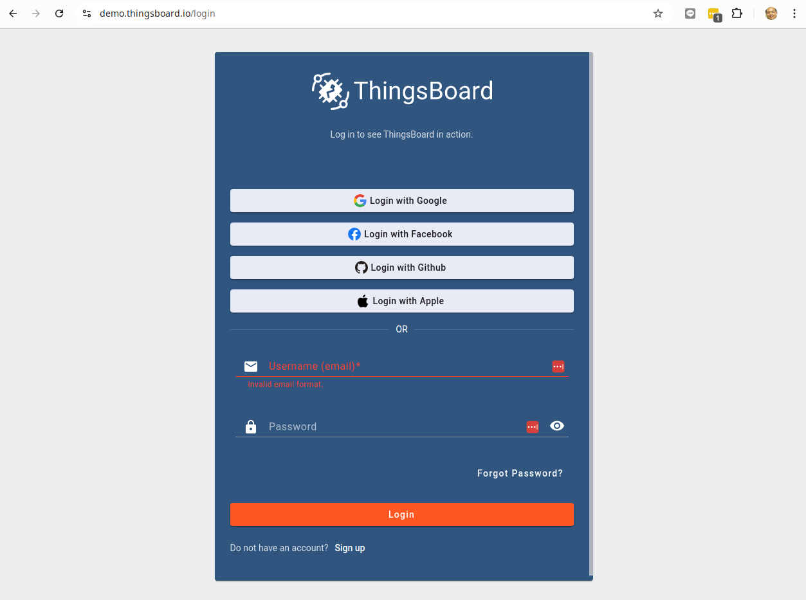

After Login with account:
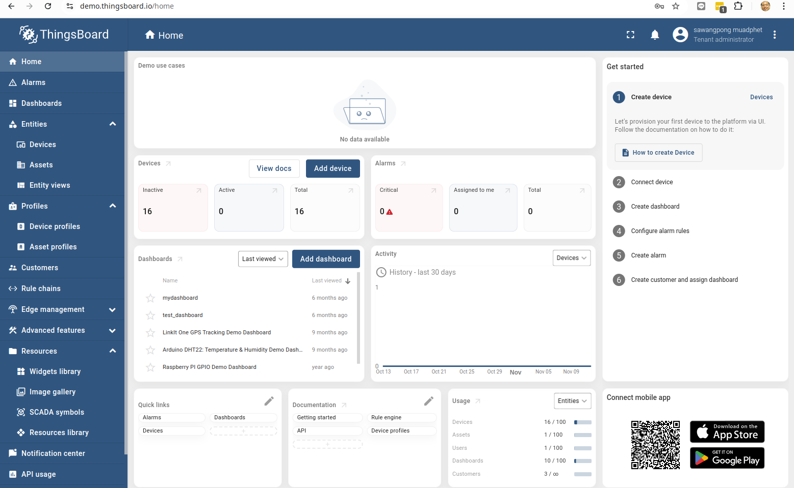

Create Device:
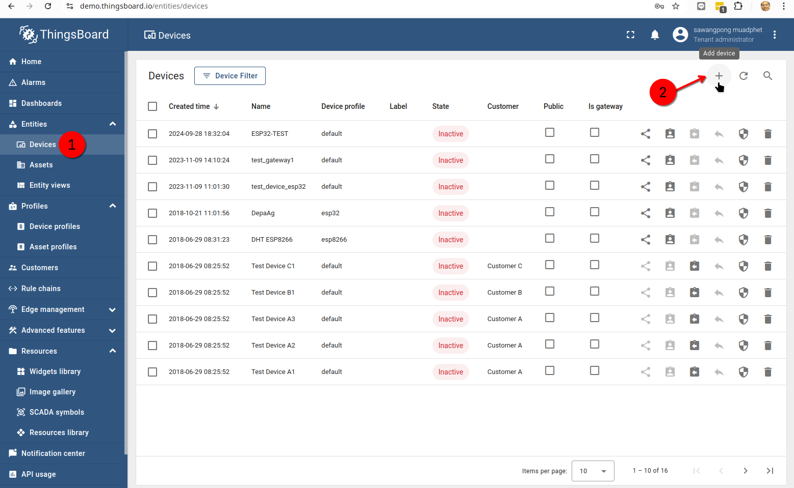

Select Menu Add Device:
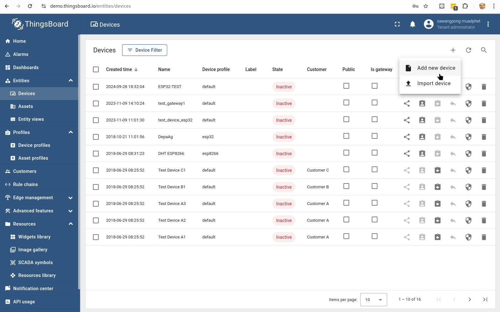

Device infomation:
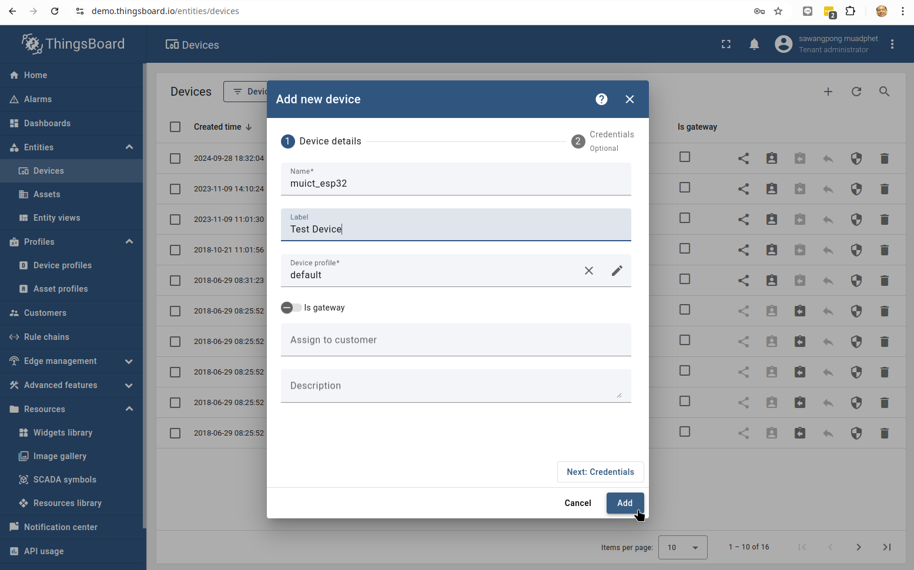

Device Test Script: Linux curl
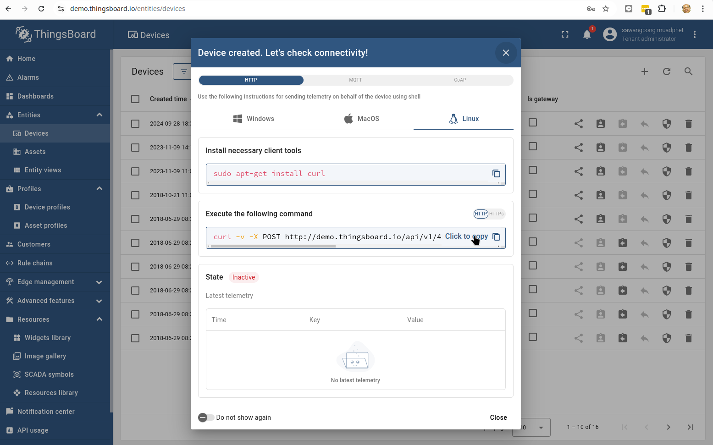

Device Test Script: MQTT
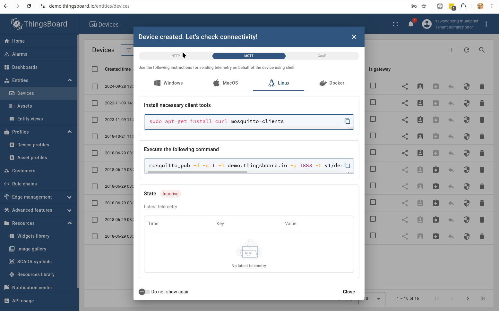

**Copy script for curl script and mqtt protocol**

- curl -v -X POST http://demo.thingsboard.io/api/v1/4KZLx8HMR4E4nVfriEQL/telemetry --header Content-Type:application/json --data "{temperature:25}"
- mosquitto_pub -d -q 1 -h demo.thingsboard.io -p 1883 -t v1/devices/me/telemetry -u "4KZLx8HMR4E4nVfriEQL" -m "{temperature:25}"

UX/UI in Dashboard: Slide in menu
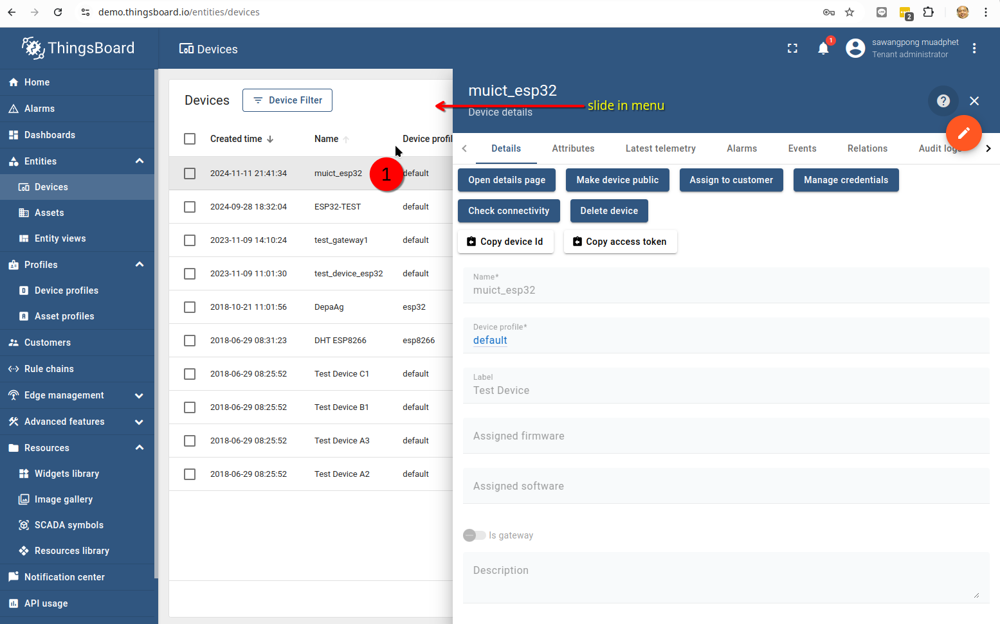

**Check information in slide in panel**

- copy device id "..."
- copy access account "..."

**copy 2 varible put into code**

Example: muict_lab1.ino

```cpp
#include <WiFi.h>
#include <PubSubClient.h>

const char* ssid = "your_wifi_ssid";             // Replace with your WiFi SSID
const char* password = "your_wifi_password";     // Replace with your WiFi Password
const char* mqtt_server = "your_thingsboard_ip"; // Replace with ThingsBoard IP
const int mqtt_port = 1883;                      // MQTT Port for ThingsBoard
const char* mqtt_token = "your_device_token";    // Replace with ThingsBoard Device Token
const char* mqtt_device_id = "your_device_id";    // Replace with ThingsBoard Device Token

WiFiClient espClient;
PubSubClient client(espClient);

void setup() {
  Serial.begin(115200);

  // Connect to WiFi
  WiFi.begin(ssid, password);
  while (WiFi.status() != WL_CONNECTED) {
    delay(500);
    Serial.print(".");
  }
  Serial.println("\nWiFi connected");

  // Setup MQTT server
  client.setServer(mqtt_server, mqtt_port);
  client.setCallback(callback);  // required to receive attribute updates and RPCs

  // Connect to MQTT and subscribe
  connectToMQTT();
}

void connectToMQTT() {
  while (!client.connected()) {
    Serial.print("Connecting to ThingsBoard MQTT...");
    if (client.connect(mqtt_device_id, mqtt_token, "")) {
      Serial.println("connected");

      // Subscribe to attribute updates
      client.subscribe("v1/devices/me/attributes");

      // Subscribe to RPC requests
      client.subscribe("v1/devices/me/rpc/request/+");

    } else {
      Serial.print("failed with state ");
      Serial.print(client.state());
      delay(2000);
    }
  }
}

void callback(char* topic, byte* payload, unsigned int length) {
  Serial.print("Message arrived [");
  Serial.print(topic);
  Serial.print("] ");

  // Copy payload to a String for easier handling
  String message;
  for (int i = 0; i < length; i++) {
    message += (char)payload[i];
  }
  Serial.println(message);

  // Check if the message is an attribute update
  if (String(topic) == "v1/devices/me/attributes") {
    Serial.println("Received attribute update: " + message);
    // Process attributes (parse message as needed)
  }

  // Check if the message is an RPC request
  if (String(topic).startsWith("v1/devices/me/rpc/request/")) {
    int requestId = String(topic).substring(26).toInt();  // Extract RPC request ID
    Serial.println("Received RPC request with ID: " + String(requestId));

    // Example: parse the RPC request (assume JSON format)
    if (message.indexOf("\"method\":\"toggleRelay\"") != -1) {
      // Process the RPC command (e.g., toggle a relay or handle a command)
      Serial.println("Toggling relay based on RPC");

      // Send response back to ThingsBoard
      String responseTopic = "v1/devices/me/rpc/response/" + String(requestId);
      String responsePayload = "{\"success\":true}";
      client.publish(responseTopic.c_str(), responsePayload.c_str());
    }
  }
}

void loop() {
  if (!client.connected()) {
    connectToMQTT();
  }
  client.loop();

  // Publish telemetry data (temperature example)
  float temperature = 22.5;  // Replace with actual sensor reading
  String payload = "{\"temperature\": " + String(temperature) + "}";

  if (client.publish("v1/devices/me/telemetry", payload.c_str())) {
    Serial.println("Telemetry sent: " + payload);
  } else {
    Serial.println("Failed to send telemetry");
  }

  delay(5000);  // Adjust as needed for your application
}
```

- Copy code to arduino ide: and save to muict_lab1
- Change variable:
  - mqtt_server
  - mqtt_token
  - mqtt_device_id

## Test shared Attribute thingsboard

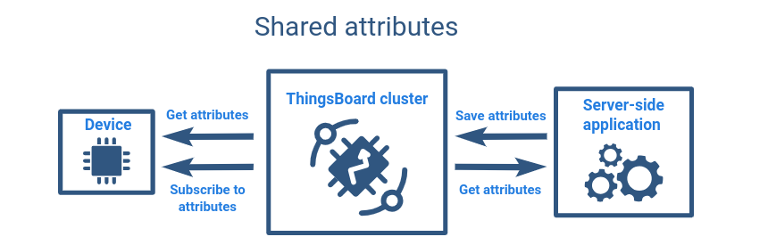

Example: muict_lab2.ino

```cpp
#include <WiFi.h>
#include <PubSubClient.h>

const char* ssid = "TrueGigatexFiber_uS7_2.4G";                       // Replace with your WiFi SSID
const char* password = "itbakery@9";                                  // Replace with your WiFi Password
const char* mqtt_server = "demo.thingsboard.io";                      // Replace with ThingsBoard IP
const int mqtt_port = 1883;                                           // MQTT Port for ThingsBoard
const char* mqtt_token = "4KZLx8HMR4E4nVfriEQL";                      // Replace with ThingsBoard Device Token
const char* mqtt_device_id = "0cc97a60-a03b-11ef-af67-a38a7671daf5";  // Replace with ThingsBoard Device Token

WiFiClient espClient;
PubSubClient client(espClient);

void setup() {
  Serial.begin(115200);

  // Connect to WiFi
  WiFi.begin(ssid, password);
  while (WiFi.status() != WL_CONNECTED) {
    delay(500);
    Serial.print(".");
  }
  Serial.println("\nWiFi connected");

  // Setup MQTT server
  client.setServer(mqtt_server, mqtt_port);
  client.setCallback(callback);  // required to receive attribute updates and RPCs

  // Connect to MQTT and subscribe
  connectToMQTT();
}

void requestAllAttributes() {
  String requestPayload = "{}";  // Empty payload requests all shared attributes
  client.publish("v1/devices/me/attributes/request/1", requestPayload.c_str());
  Serial.println("All attributes request sent");
}

void connectToMQTT() {
  while (!client.connected()) {
    Serial.print("Connecting to ThingsBoard MQTT...");
    if (client.connect(mqtt_device_id, mqtt_token, "")) {
      Serial.println("connected");

      // Subscribe to attribute updates
      client.subscribe("v1/devices/me/attributes");

      // Subscribe to RPC requests
      client.subscribe("v1/devices/me/rpc/request/+");
      requestAllAttributes();

    } else {
      Serial.print("failed with state ");
      Serial.print(client.state());
      delay(2000);
    }
  }
}

void callback(char* topic, byte* payload, unsigned int length) {
  Serial.print("Message arrived [");
  Serial.print(topic);
  Serial.print("] ");

  // Copy payload to a String for easier handling
  String message;
  for (int i = 0; i < length; i++) {
    message += (char)payload[i];
  }
  Serial.println(message);

  // Check if the message is an attribute update
  if (String(topic) == "v1/devices/me/attributes") {
    Serial.println("Received attribute update: " + message);
    // Process attributes (parse message as needed)
    // Here implement message
  }

  // Check if the message is an RPC request
  if (String(topic).startsWith("v1/devices/me/rpc/request/")) {
    int requestId = String(topic).substring(26).toInt();  // Extract RPC request ID
    Serial.println("Received RPC request with ID: " + String(requestId));

    // Example: parse the RPC request (assume JSON format)
    if (message.indexOf("\"method\":\"toggleRelay\"") != -1) {
      // Process the RPC command (e.g., toggle a relay or handle a command)
      Serial.println("Toggling relay based on RPC");

      // Send response back to ThingsBoard
      String responseTopic = "v1/devices/me/rpc/response/" + String(requestId);
      String responsePayload = "{\"success\":true}";
      client.publish(responseTopic.c_str(), responsePayload.c_str());
    }
  }
}

void loop() {
  if (!client.connected()) {
    connectToMQTT();
  }
  client.loop();

  // Publish telemetry data (temperature example)
  float temperature = 22.5;  // Replace with actual sensor reading
  String payload = "{\"temperature\": " + String(temperature) + "}";

  if (client.publish("v1/devices/me/telemetry", payload.c_str())) {
    Serial.println("Telemetry sent: " + payload);
  } else {
    Serial.println("Failed to send telemetry");
  }

  delay(5000);  // Adjust as needed for your application
}

```

## Go to thingsbaord dashboard

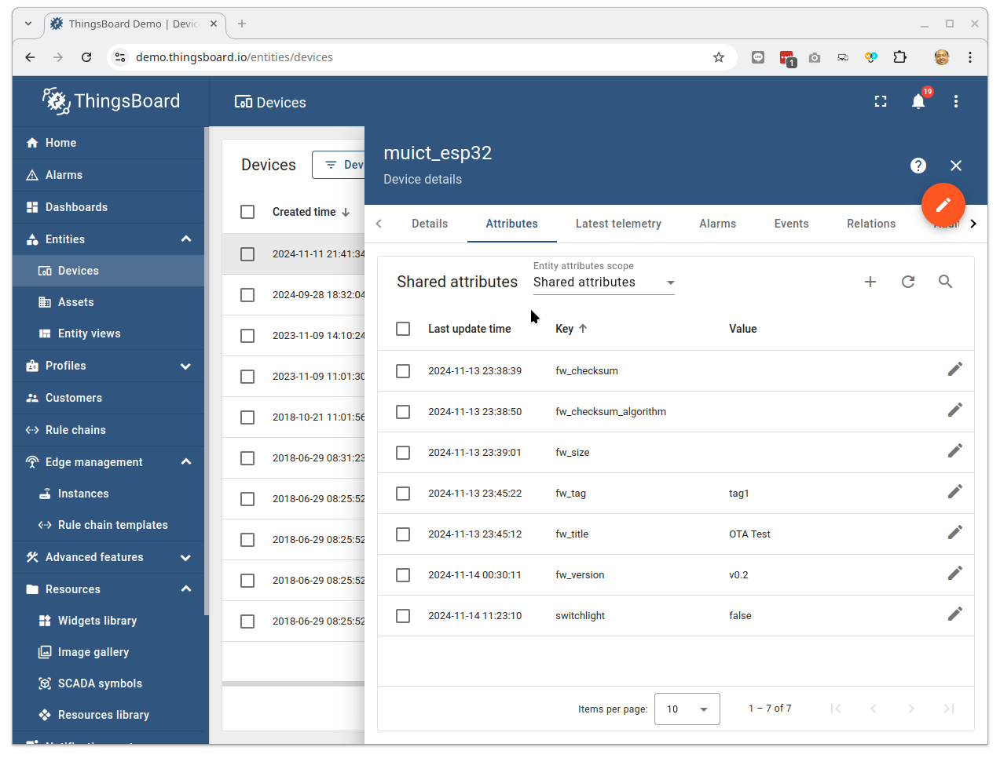

!!! note "Test shared attribute"

    Try to change , add value in share attribute and check serial monitor

## What next from here

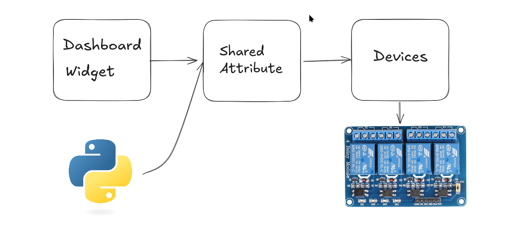
