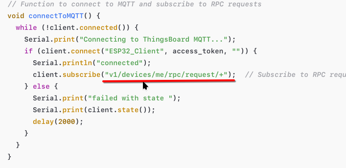
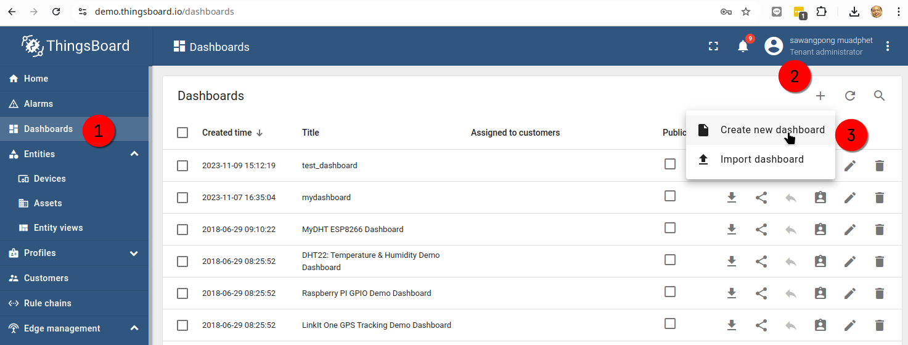
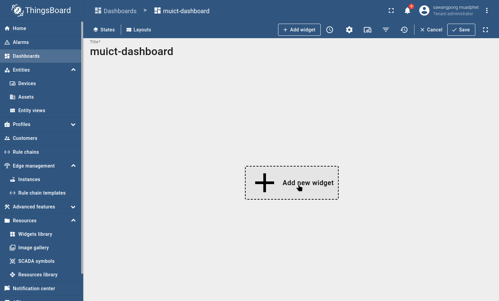
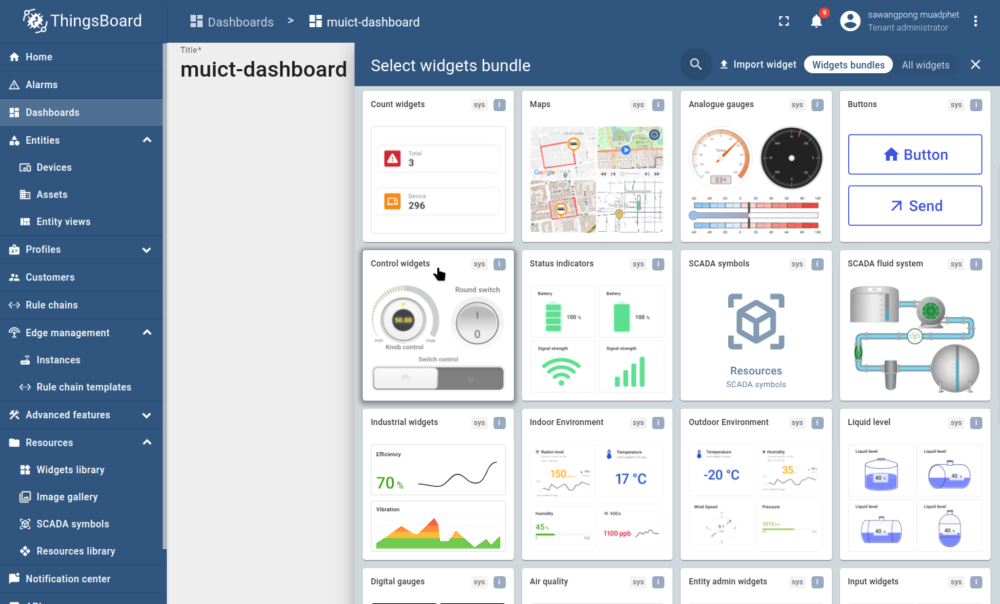
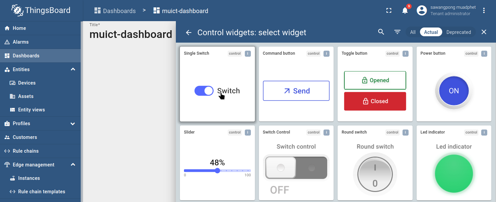
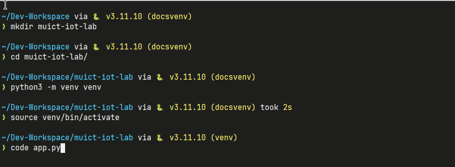
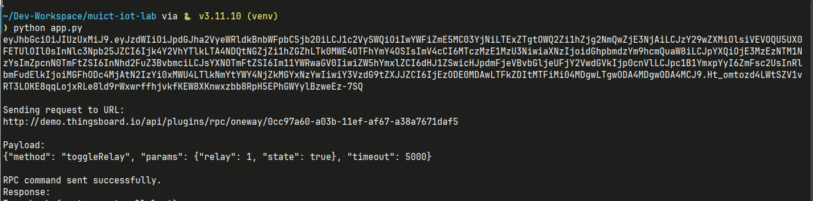
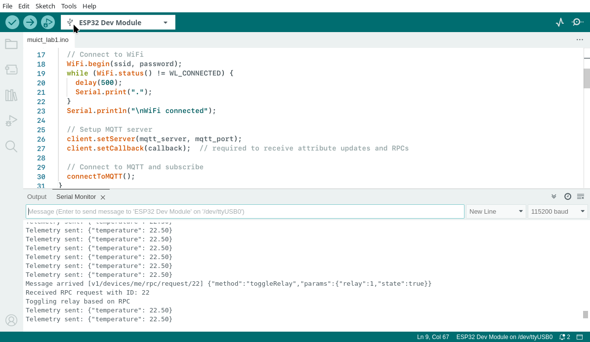

# 4 What's RPC control?

ThingsBoard RPC (Remote Procedure Call) control allows you to send commands from the ThingsBoard server to a device, which is especially useful for controlling connected devices. Here's how to set up and handle RPC commands on ThingsBoard and the ESP32 device.

esp32 have to subcript on topic **v1/devices/me/rpc/request/+**

!!! note "what is + sign in topic"

    + symbol is a wildcard character used in topics to match a single level in the topic hierarchy. It allows a subscriber to listen to multiple topics with similar structures by replacing one level in the topic hierarchy with +

    For example, given these topics:

    home/livingroom/temperature
    home/kitchen/temperature
    home/bedroom/temperature

    Examples of + Usage
    Topic Matching:

        sensors/+/humidity would match:
        sensors/livingroom/humidity
        sensors/bedroom/humidity

    But it would not match sensors/humidity (because + requires exactly one level to match).
    Multi-level Matching:

        sensors/+/temperature would match any temperature readings from one level below sensors/, but only if there’s exactly one additional level.



## Lab1 Send RPC control from dashboard

- Create Dashboard for esp32 device
  

- Create Dashboard "muict-dashboard"
  

- Add widget to dasboard  
  

- Select Control widget
  

- Select Single Button
  

- Select Device muict_esp32 , add click add
  

- Check result in arduino ide terminal
  

- try to click swich for 2-3 times and see result
  

!!! note ""

    request id will incliment by one
        v1/devices/me/rpc/request/1
        v1/devices/me/rpc/request/2
        v1/devices/me/rpc/request/3

## Lab2 Send RPC from python

create python environment

```
mkdir muict-iot-lab
cd muict-iot-lab
python3 -m venv venv

venv\Script\activate    (windows)
source venv/bin/activate
```



install depemdencies:

```bash
pip install requests
```

copy code and run in terminal save as "app.py" .

```python
import requests
import json

# Replace these with your ThingsBoard credentials and device information
THINGSBOARD_HOST = 'http://demo.thingsboard.io'  # or your own ThingsBoard server
USERNAME = 'your_username'                        # Your ThingsBoard username
PASSWORD = 'your_password'                        # Your ThingsBoard password
DEVICE_ID = 'your_device_id'                      # Device ID of the target device


# Step 1: Get the JWT token
def get_jwt_token():
    url = f"{THINGSBOARD_HOST}/api/auth/login"
    headers = {"Content-Type": "application/json"}
    payload = json.dumps({"username": USERNAME, "password": PASSWORD})

    response = requests.post(url, headers=headers, data=payload)

    if response.status_code == 200:
        print(response.json()["token"])
        return response.json()["token"]
    else:
        print("Failed to get JWT token:", response.status_code, response.text)
        return None

# Step 2: Send RPC command to the device
def send_rpc_request(jwt_token, method, params, timeout=5000):
    url = f"{THINGSBOARD_HOST}/api/plugins/rpc/oneway/{DEVICE_ID}"
    headers = {
        "Content-Type": "application/json",
        "X-Authorization": f"Bearer {jwt_token}"
    }

    payload = json.dumps({
        "method": method,
        "params": params,
        "timeout": timeout
    })

    # Debugging: print URL and payload with newlines for better readability
    print("\nSending request to URL:")
    print(url)
    print("\nPayload:")
    print(payload)

    # Send the request
    response = requests.post(url, headers=headers, data=payload)

    if response.status_code == 200:
        print("\nRPC command sent successfully.")
        print("Response:")
        print(response.json())
    else:
        print(f"\nFailed to send RPC command: {response.status_code}")
        print("Response body:")
        print(response.text)  # View the response body for debugging


# Main function to send an RPC command
def main():
    jwt_token = get_jwt_token()
    if jwt_token:
        method = "toggleRelay"  # RPC method name (e.g., 'toggleRelay')
        params = {              # Parameters to send with the RPC command
            "relay": 1,
            "state": True
        }

        send_rpc_request(jwt_token, method, params)

if __name__ == "__main__":
    main()
```



- Check arduino output


