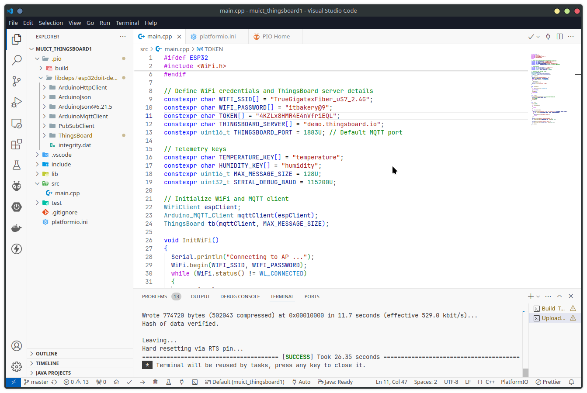
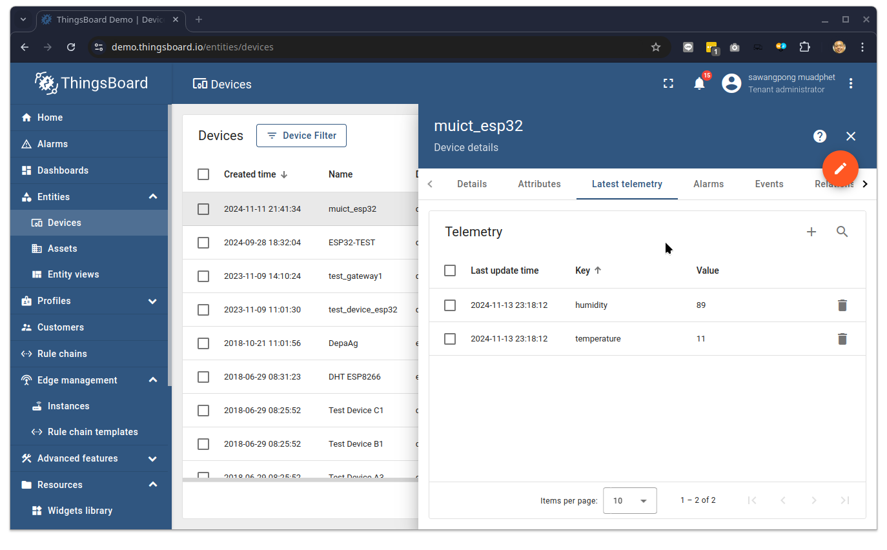
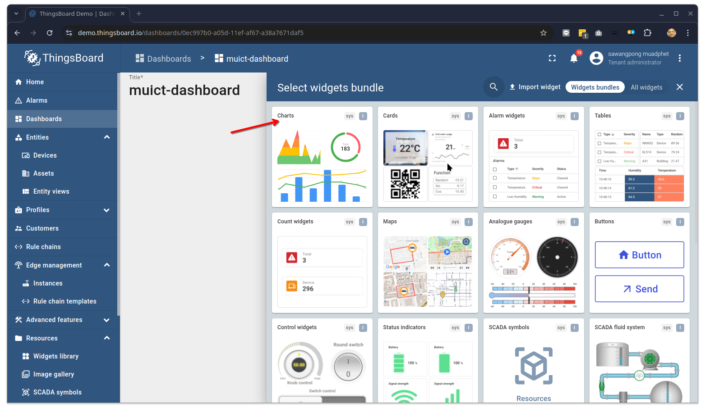
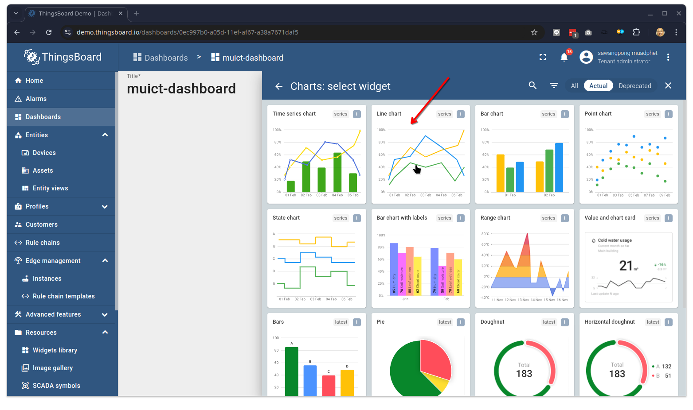
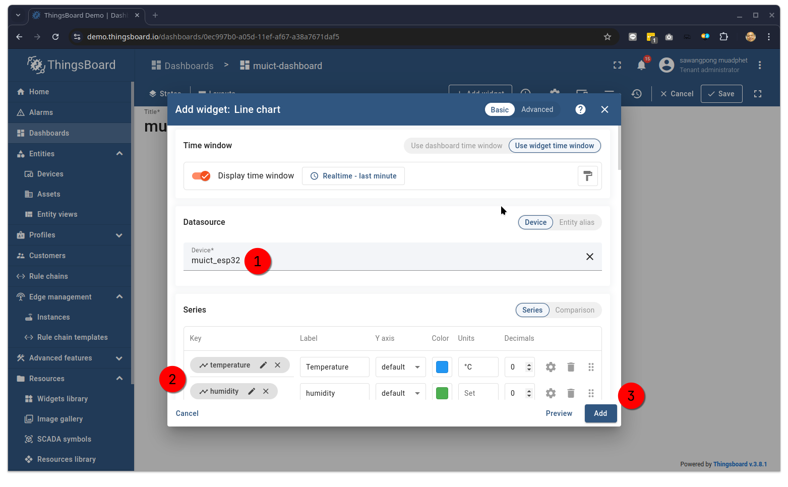
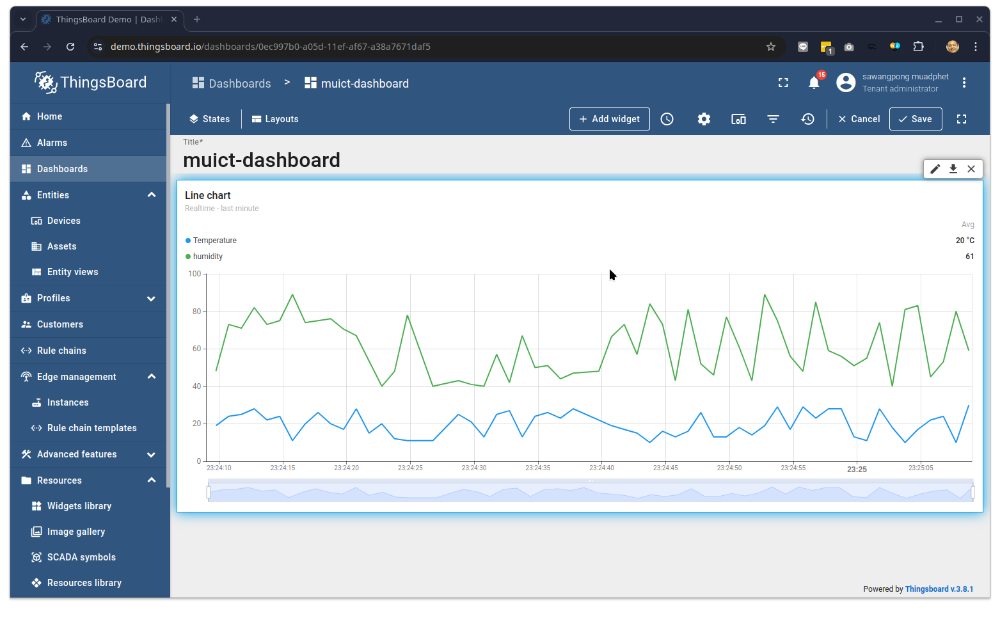

# 5 Introduct Thingsboard.h library

The ThingsBoard.h library provides an interface for ESP32 (or other devices) to connect to a ThingsBoard IoT platform instance, allowing for telemetry data transmission, RPC (remote procedure call) commands, and more. Here’s a basic guide on how to set it up and use it:

prerequisition:
1 Run in Platform.io



Example Code:

```cpp
#ifdef ESP32
#include <WiFi.h>
#include <WiFiClient.h>
#include <Arduino_MQTT_Client.h>
#include <ThingsBoard.h>
#endif

// Define WiFi credentials and ThingsBoard server details
constexpr char WIFI_SSID[] = "YOUR_WIFI_SSID";
constexpr char WIFI_PASSWORD[] = "YOUR_WIFI_PASSWORD";
constexpr char TOKEN[] = "YOUR_DEVICE_ACCESS_TOKEN";
constexpr char THINGSBOARD_SERVER[] = "demo.thingsboard.io";
constexpr uint16_t THINGSBOARD_PORT = 1883U; // Default MQTT port

// Telemetry keys
constexpr char TEMPERATURE_KEY[] = "temperature";
constexpr char HUMIDITY_KEY[] = "humidity";
constexpr uint16_t MAX_MESSAGE_SIZE = 128U;
constexpr uint32_t SERIAL_DEBUG_BAUD = 115200U;

// Initialize WiFi and MQTT client
WiFiClient espClient;
Arduino_MQTT_Client mqttClient(espClient);
ThingsBoard tb(mqttClient, MAX_MESSAGE_SIZE);

void InitWiFi()
{
  Serial.println("Connecting to AP ...");
  WiFi.begin(WIFI_SSID, WIFI_PASSWORD);
  while (WiFi.status() != WL_CONNECTED)
  {
    delay(500);
    Serial.print(".");
  }
  Serial.println("Connected to AP");
}

bool reconnect()
{
  if (WiFi.status() == WL_CONNECTED)
  {
    return true;
  }
  InitWiFi();
  return true;
}

void setup()
{
  randomSeed(analogRead(0)); // Initialize random seed
  Serial.begin(SERIAL_DEBUG_BAUD);
  delay(1000);
  InitWiFi();
}

void loop()
{
  delay(1000);

  if (!reconnect())
  {
    return;
  }

  if (!tb.connected())
  {
    Serial.printf("Connecting to: %s with token %s\n", THINGSBOARD_SERVER, TOKEN);
    if (!tb.connect(THINGSBOARD_SERVER, TOKEN, THINGSBOARD_PORT))
    {
      Serial.println("Failed to connect");
      return;
    }
  }

  Serial.println("Sending temperature data...");
  tb.sendTelemetryData(TEMPERATURE_KEY, random(10, 31));

  Serial.println("Sending humidity data...");
  tb.sendTelemetryData(HUMIDITY_KEY, random(40, 90));

  tb.loop();
}

```

platform.ini

```
[env:esp32doit-devkit-v1]
platform = espressif32
board = esp32doit-devkit-v1
framework = arduino
lib_ldf_mode = chain+
lib_deps =
    Update
    knolleary/PubSubClient @ ^2.8
    arduino-libraries/ArduinoHttpClient @ ^0.6.1
    bblanchon/ArduinoJson @ ^7.2.0
    https://github.com/thingsboard/thingsboard-client-sdk.git
    https://github.com/arduino-libraries/ArduinoMqttClient.git

monitor_speed = 115200
```



Add chart:


Add Line Chart:


Add Data Source info:


Result Data Visualization:

