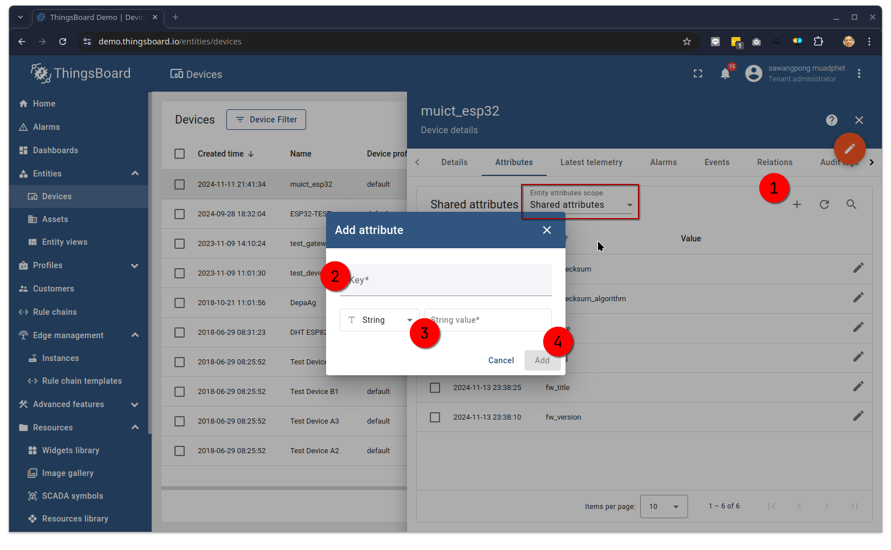
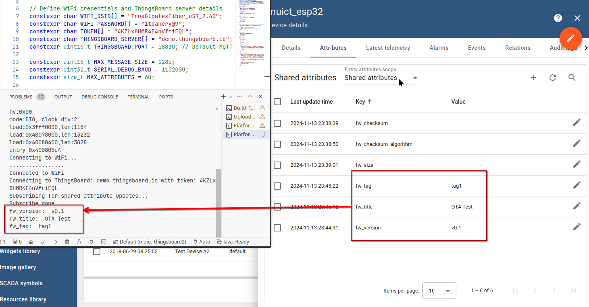

# Thingsboard Shared Attribute

In ThingsBoard, shared attributes are configuration values or settings that are stored on the server and can be updated by both the server and the device. They are ideal for managing device configurations remotely, such as firmware version, thresholds, or operational settings. Devices can receive updates for these attributes without needing to continuously poll the server, making shared attributes efficient for IoT applications.  
**Key Features of Shared Attributes:**

1 Server-Device Synchronization: Shared attributes are updated on the ThingsBoard server and synchronized to the device, ensuring consistency.  
2 Subscription-Based Updates: Devices can subscribe to receive updates when specific shared attributes change on the server, eliminating the need for continuous polling.  
3 Remote Configuration: Using shared attributes, you can remotely manage and adjust device settings or configurations in real-time.

**Implementation Summary:**

1 Subscribe to Attributes: In the device code, the device subscribes to specific shared attributes (e.g., "fw_version", "fw_tag").
2 Callback on Update: When ThingsBoard sends an update, the device’s callback function processes 3 the changes (e.g., updating the firmware version or configurations).  
4 Two-Way Communication: Both the server and the device can update shared attributes, allowing flexible and responsive device management.

This makes shared attributes a powerful tool for IoT devices that require dynamic and centralized configuration management.

```cpp
#include <WiFi.h>
#include <Arduino_MQTT_Client.h>
#include <Shared_Attribute_Update.h>
#include <ThingsBoard.h>

constexpr char WIFI_SSID[] = "YOUR_WIFI_SSID";
constexpr char WIFI_PASSWORD[] = "YOUR_WIFI_PASSWORD";
constexpr char TOKEN[] = "YOUR_DEVICE_ACCESS_TOKEN";
constexpr char THINGSBOARD_SERVER[] = "demo.thingsboard.io";
constexpr uint16_t THINGSBOARD_PORT = 1883U;  // Unencrypted MQTT port

constexpr uint16_t MAX_MESSAGE_SIZE = 128U;
constexpr uint32_t SERIAL_DEBUG_BAUD = 115200U;
constexpr size_t MAX_ATTRIBUTES = 6U;

WiFiClient espClient;
Arduino_MQTT_Client mqttClient(espClient);
Shared_Attribute_Update<1U, MAX_ATTRIBUTES> shared_update;
const std::array<IAPI_Implementation*, 1U> apis = { &shared_update };
ThingsBoard tb(mqttClient, MAX_MESSAGE_SIZE, Default_Max_Stack_Size, apis);

bool subscribed = false;

void InitWiFi() {
  Serial.println("Connecting to WiFi...");
  WiFi.begin(WIFI_SSID, WIFI_PASSWORD);
  while (WiFi.status() != WL_CONNECTED) {
    delay(500);
    Serial.print(".");
  }
  Serial.println("\nConnected to WiFi");
}

bool reconnect() {
  if (WiFi.status() == WL_CONNECTED) {
    return true;
  }
  InitWiFi();
  return true;
}

void processSharedAttributeUpdate(const JsonObjectConst &data) {
  for (auto it = data.begin(); it != data.end(); ++it) {
    Serial.print(it->key().c_str());
    Serial.print(": ");
    Serial.println(it->value().as<const char*>());
  }
}

void setup() {
  Serial.begin(SERIAL_DEBUG_BAUD);
  delay(1000);
  InitWiFi();
}

void loop() {
  delay(1000);

  if (!reconnect()) {
    return;
  }

  if (!tb.connected()) {
    Serial.printf("Connecting to ThingsBoard: %s with token: %s\n", THINGSBOARD_SERVER, TOKEN);
    if (!tb.connect(THINGSBOARD_SERVER, TOKEN, THINGSBOARD_PORT)) {
      Serial.println("Failed to connect to ThingsBoard");
      return;
    }
  }

  if (!subscribed) {
    Serial.println("Subscribing for shared attribute updates...");
    constexpr std::array<const char*, MAX_ATTRIBUTES> SUBSCRIBED_SHARED_ATTRIBUTES = {
      "fw_tag", "fw_version", "fw_title", "fw_checksum", "fw_checksum_algorithm", "fw_size"
    };
    const Shared_Attribute_Callback<MAX_ATTRIBUTES> callback(&processSharedAttributeUpdate, SUBSCRIBED_SHARED_ATTRIBUTES);
    if (!shared_update.Shared_Attributes_Subscribe(callback)) {
      Serial.println("Failed to subscribe for shared attribute updates");
      return;
    }

    Serial.println("Subscribe done");
    subscribed = true;
  }

  tb.loop();
}
```

Add attrubute to thingsboard: manual


Try to change some value of shard attribute


