# 2 Arduino IDE

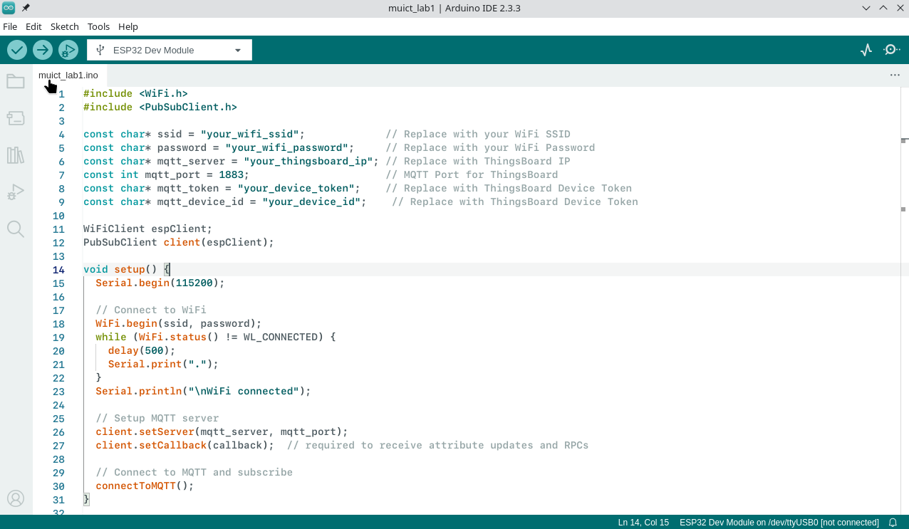

## Lab1: Arduino Upload data

- Copy 4 screen from your pc and thingsboard account in Word

  1.1 Build and uplod to thingsboard

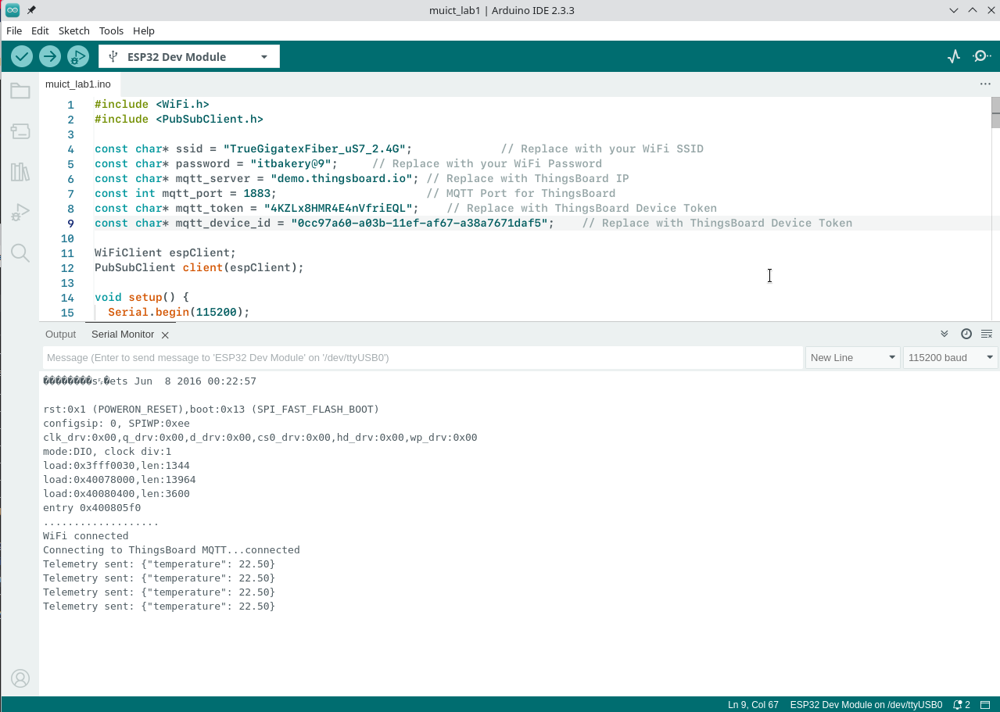
2.2 Check Thingsboard Dashboard in Device name "muict_esp32"

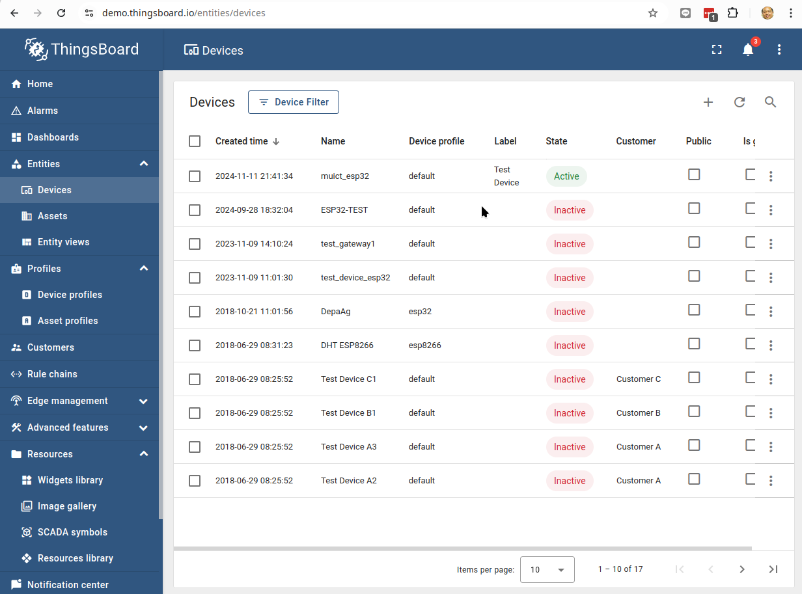

3.3 Check Attribues in Device Infomations


3.4 Check Telemetry Data

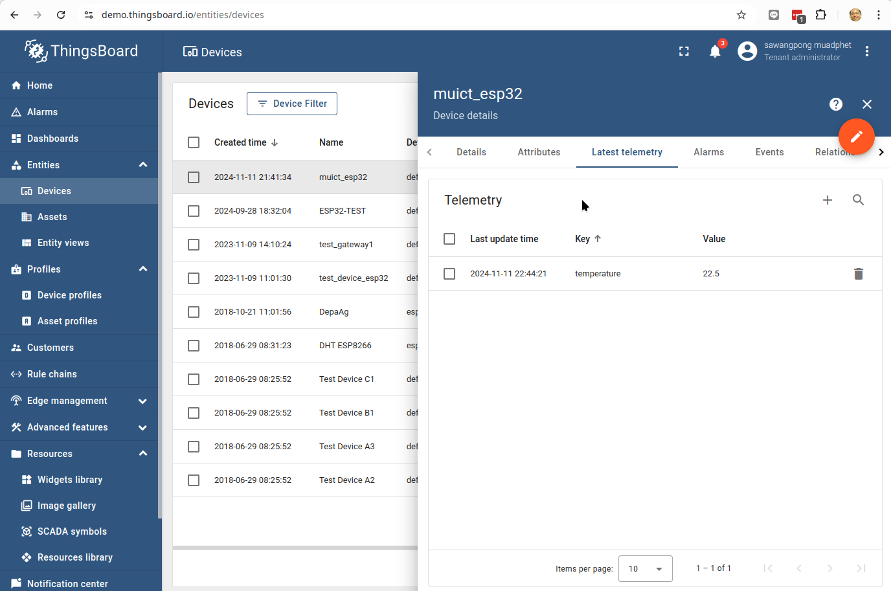

## Lab2: Cli command line

2.1 Command Line Authentication to get authen token  
To authenticate with ThingsBoard’s REST API from the command line using curl, you need to use the login endpoint to get a JWT (JSON Web Token) token. Here’s how to do it:

```
curl -X POST -H "Content-Type: application/json" \
-d '{"username":"YOUR_USERNAME","password":"YOUR_PASSWORD"}' \
http://YOUR_THINGSBOARD_SERVER/api/auth/login

```

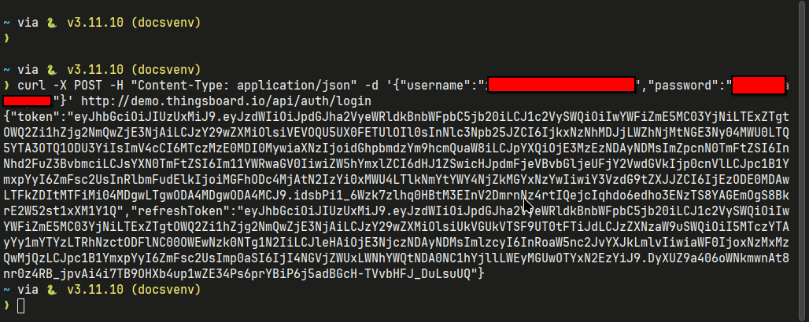

2.2 Use command line to send data to thingsboard account

[https://thingsboard.io/docs/user-guide/telemetry/](https://thingsboard.io/docs/user-guide/telemetry/)

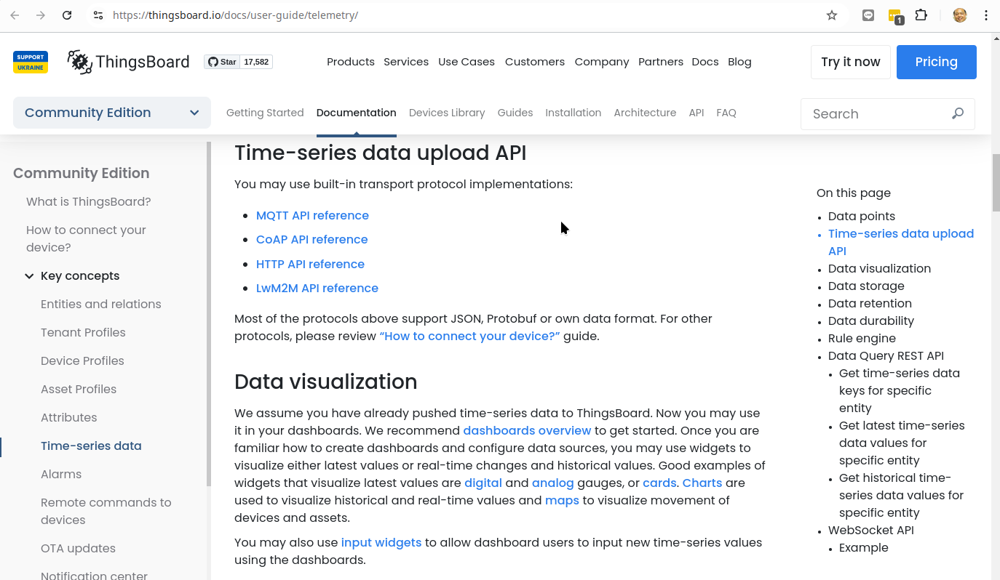

Get access_token first from Dashboard by click [copy access token] will save in clipboard

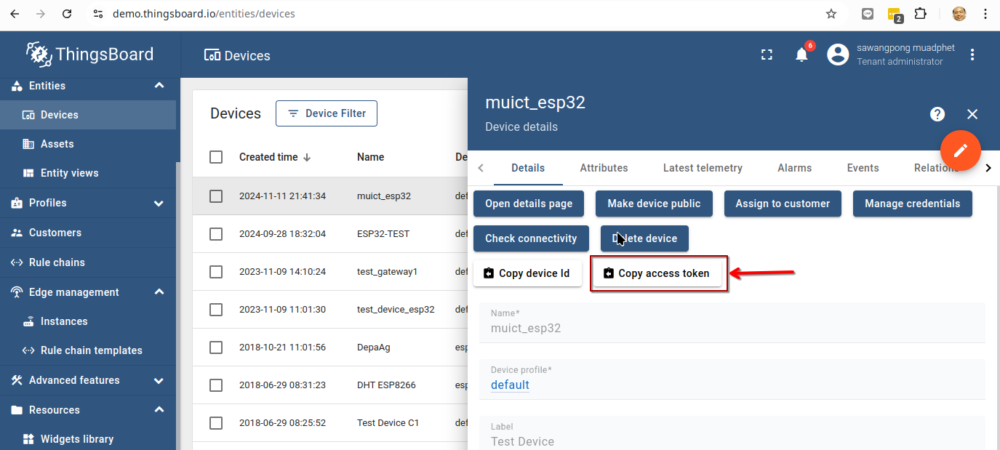

1 upload data by HTTP API

```
$ export THINGSBOARD_HOST_NAME=demo.thingsboard.io
$ export ACCESS_TOKEN=<from device information>
$ mosquitto_pub -d -q 1 -h "$THINGSBOARD_HOST_NAME" -p "1883" -t "v1/devices/me/telemetry" -u "$ACCESS_TOKEN" -m {"temperature":30}
```

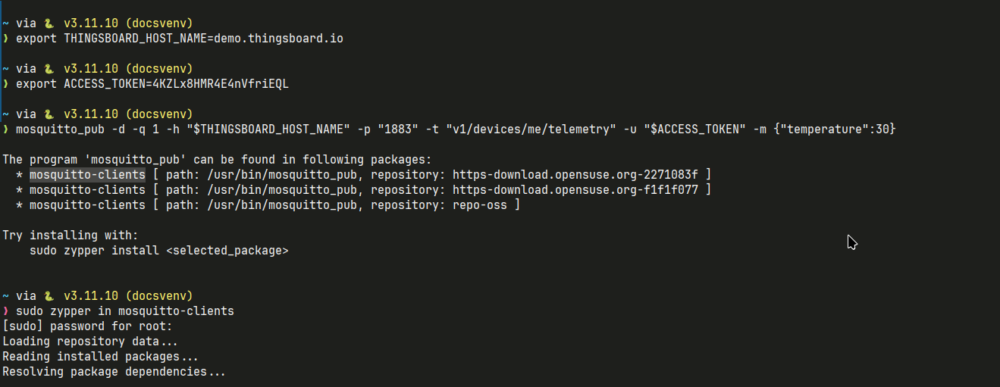

after install mqtt client package, Let try it again

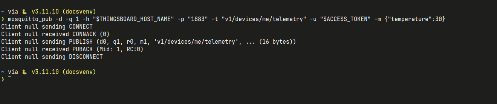

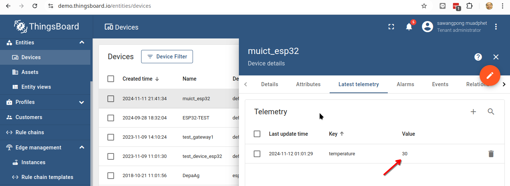

!!! note "Basic Linux Shell variable set/get"

    - export VARIABLE=value
    - $VARIABLE  get value
    - need install mosquitto_pub in linux (ubuntu/centos/) first
    - $ACCESS_TOKEN - device access token.

2 upload data by HTTP POST

- URL /api/v1/{ACCESS_TOKEN}/telemetry

```
echo $ACCESS_TOKEN
curl -v -X POST --data "{"temperature":42,"humidity":73}" https://demo.thingsboard.io/api/v1/$ACCESS_TOKEN/telemetry --header "Content-Type:application/json"
```

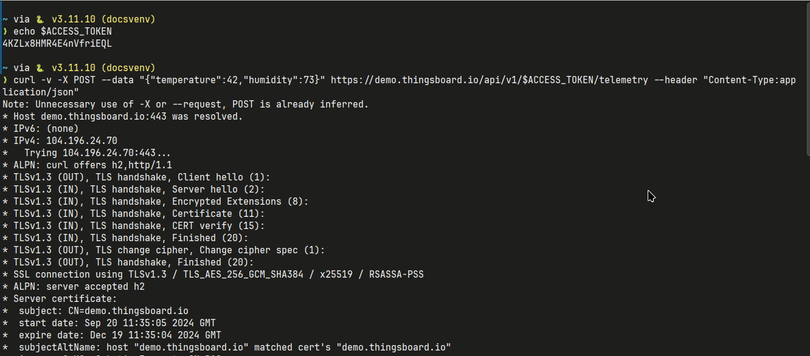

Ensure that you're connecting to ThingsBoard over HTTPS, especially if the ThingsBoard instance is set to require secure connections.

!!! note "Basic curl command"

    The curl command you provided is almost correct, but it has a syntax issue with the JSON payload. You should escape the quotes around the JSON payload or use single quotes around the entire JSON body.

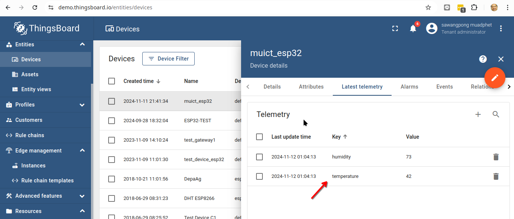

!!! note "if Error, here Explanation:"

    **if Error, here Explanation:**
    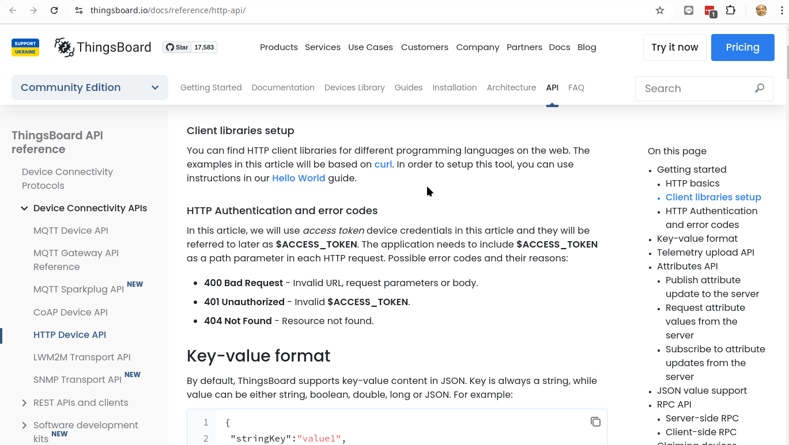
    [https://thingsboard.io/docs/reference/http-api/](https://thingsboard.io/docs/reference/http-api/)

3 Use mqtt client App. Example [https://mqttx.app/](https://mqttx.app/)

- Download and install application:

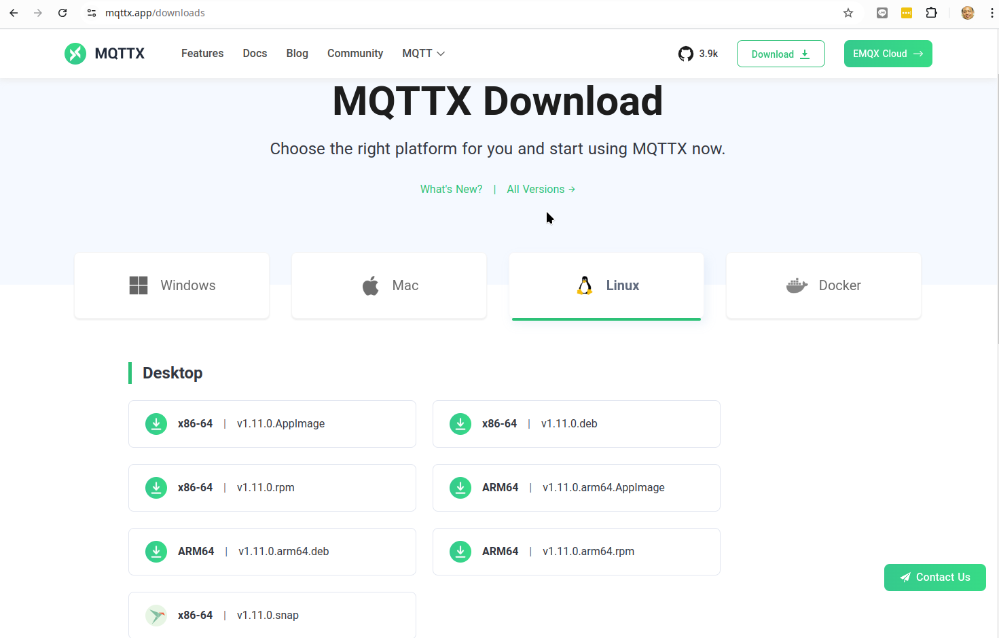

- Create connection:

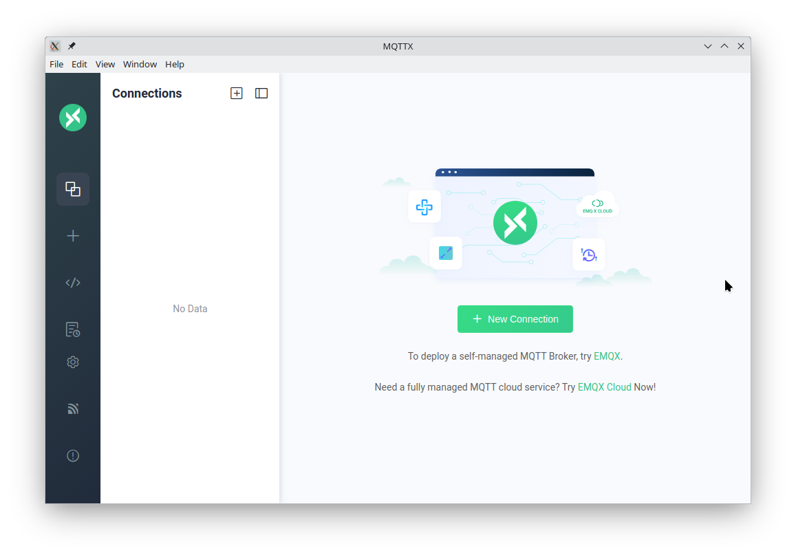

- Connection Info:

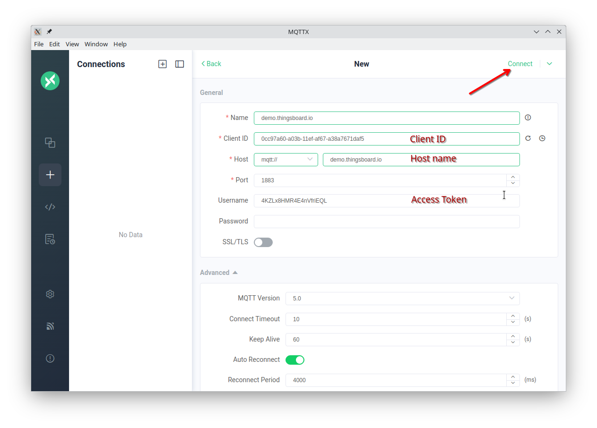

- publish Data: v1/devices/me/telemetry:

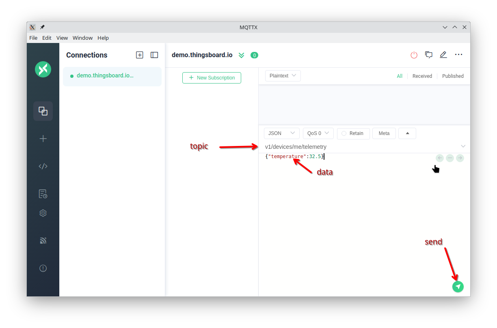

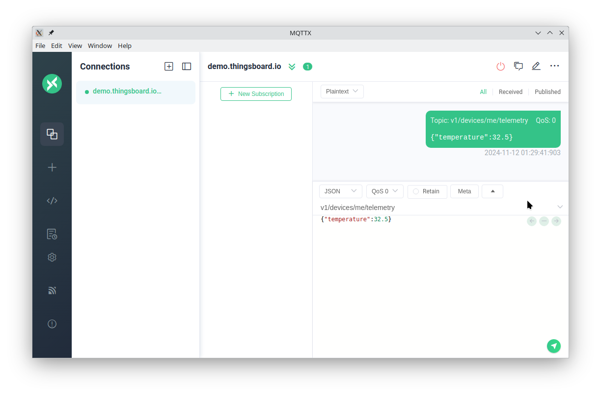

- Check Data again:

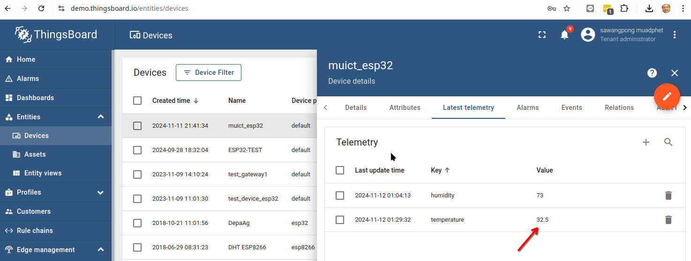

!!! info "Summary"

    Remember topic  "v1/devices/me/telemetry"  use for public data to thingsboard iot Gateway by mqtt protocol
