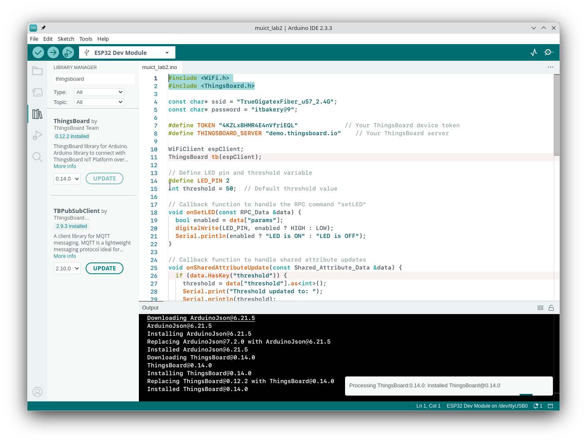

# Thingsboard.h libraru

The ThingsBoard.h library provides an interface for ESP32 (or other devices) to connect to a ThingsBoard IoT platform instance, allowing for telemetry data transmission, RPC (remote procedure call) commands, and more. Here’s a basic guide on how to set it up and use it:

Example Code: muict-lab2/

```c
#include <WiFi.h>
#include <ThingsBoard.h>

const char* ssid = "your_ssid";
const char* password = "your_password";

#define TOKEN "your_access_token"             // Your ThingsBoard device token
#define THINGSBOARD_SERVER "your_server_ip"    // Your ThingsBoard server

WiFiClient espClient;
ThingsBoard tb(espClient);

// Define LED pin and threshold variable
#define LED_PIN 2
int threshold = 50;  // Default threshold value

// Callback function to handle the RPC command "setLED"
void onSetLED(const RPC_Data &data) {
  bool enabled = data["params"];
  digitalWrite(LED_PIN, enabled ? HIGH : LOW);
  Serial.println(enabled ? "LED is ON" : "LED is OFF");
}

// Callback function to handle shared attribute updates
void onSharedAttributeUpdate(const Shared_Attribute_Data &data) {
  if (data.HasKey("threshold")) {
    threshold = data["threshold"].as<int>();
    Serial.print("Threshold updated to: ");
    Serial.println(threshold);
  }
}

void setup() {
  Serial.begin(115200);
  pinMode(LED_PIN, OUTPUT);

  // Connect to Wi-Fi
  WiFi.begin(ssid, password);
  while (WiFi.status() != WL_CONNECTED) {
    delay(500);
    Serial.print(".");
  }
  Serial.println("Connected to Wi-Fi");

  // Connect to ThingsBoard
  if (!tb.connect(THINGSBOARD_SERVER, TOKEN)) {
    Serial.println("Failed to connect to ThingsBoard");
  } else {
    Serial.println("Connected to ThingsBoard");

    // Subscribe to the "setLED" RPC command
    tb.RPC_Subscribe("setLED", onSetLED);

    // Request the current value of the shared attribute "threshold"
    tb.Shared_Attributes_Request("threshold", onSharedAttributeUpdate);

    // Subscribe to updates for shared attributes
    tb.Shared_Attributes_Subscribe(onSharedAttributeUpdate);
  }
}

void loop() {
  // Reconnect if disconnected
  if (!tb.connected()) {
    if (!tb.connect(THINGSBOARD_SERVER, TOKEN)) {
      Serial.println("Failed to reconnect to ThingsBoard");
      delay(5000);
      return;
    }
    Serial.println("Reconnected to ThingsBoard");

    // Re-subscribe to the RPC command and shared attributes after reconnecting
    tb.RPC_Subscribe("setLED", onSetLED);
    tb.Shared_Attributes_Subscribe(onSharedAttributeUpdate);
  }

  tb.loop();  // Maintain the MQTT connection and handle RPC calls and shared attribute updates
  delay(1000);
}
```

**Explanation of Key Parts**

- **onSharedAttributeUpdate() Callback Function:** This function is called whenever an update to the shared attribute ("threshold") is received. It retrieves the updated value of the attribute and assigns it to the local threshold variable.

- **tb.Shared_Attributes_Request("threshold", onSharedAttributeUpdate);:** This function requests the current value of the "threshold" shared attribute from ThingsBoard as soon as the ESP32 connects. The current value is then retrieved and handled by onSharedAttributeUpdate.

- **tb.Shared_Attributes_Subscribe(onSharedAttributeUpdate);:** This function subscribes the ESP32 to receive updates for any shared attributes, ensuring that the device is notified whenever "threshold" is changed on the ThingsBoard server.


