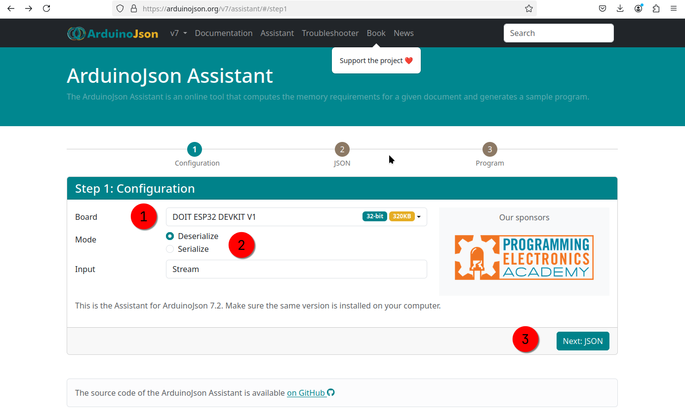
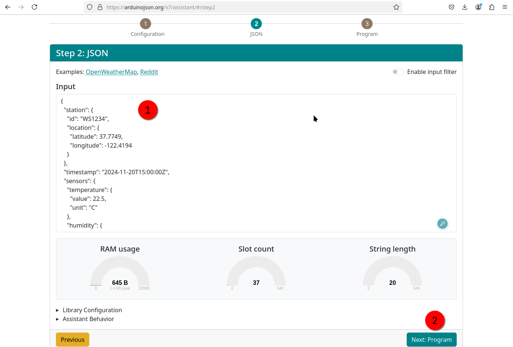
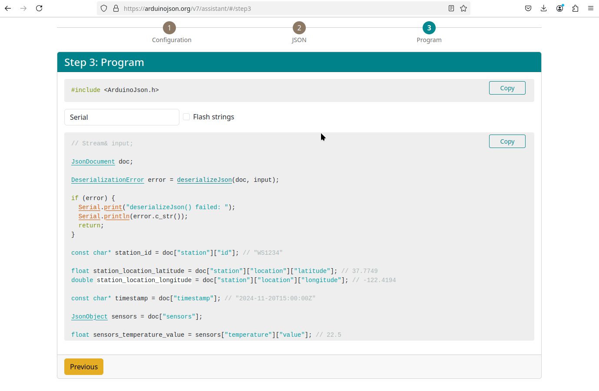

# Intriduction to ArduinoJson 7

ArduinoJson 7 is a lightweight and efficient JSON library for Arduino and embedded C++ projects. It's designed for parsing, creating, and manipulating JSON objects while being memory-efficient, making it ideal for resource-constrained devices like ESP32, ESP8266, and Arduino boards.
Key Features of ArduinoJson 7

1. JSON Parsing: Decode JSON strings received from APIs, sensors, or other devices.
2. JSON Serialization: Create JSON strings to send to servers or other devices.
3. Memory Efficiency: Works well on devices with limited RAM.
4. Static or Dynamic Memory Allocation: Gives you control over how memory is managed.
5. Compatibility: Works with Arduino, ESP32, ESP8266, STM32, and other C++ platforms.

## How ArduinoJson Works

ArduinoJson revolves around these core concepts:

1. JsonDocument: A container to store JSON objects and arrays in memory.
   - StaticJsonDocument: Uses fixed-size memory; prevents fragmentation.
   - DynamicJsonDocument: Allocates memory dynamically; more flexible but risks fragmentation.
2. JsonObject: Represents a JSON object with key-value pairs.
3. JsonArray: Represents a JSON array with ordered values.

## Parsing a JSON String

```c title="main.cpp"
#include <ArduinoJson.h>

const char* json = "{\"sensor\":\"temperature\", \"value\":23.5}";

void setup() {
  Serial.begin(115200);

  // Create a JsonDocument with enough capacity
  JsonDocument doc;

  // Parse JSON string
  DeserializationError error = deserializeJson(doc, json);

  if (error) {
    Serial.print("Failed to parse JSON: ");
    Serial.println(error.f_str());
    return;
  }

  // Access JSON values
  const char* sensor = doc["sensor"];
  float value = doc["value"];

  // Print parsed values
  Serial.println(sensor); // Output: temperature
  Serial.println(value);  // Output: 23.5
}

void loop() {
  // Your main loop code
}
```

## Creating a JSON Object

```c title="main.cpp"
#include <ArduinoJson.h>

void setup() {
  Serial.begin(115200);

  // Create a JsonDocument
  JsonDocument doc;

  // Populate JSON object
  doc["sensor"] = "temperature";
  doc["value"] = 23.5;

  // Serialize to string
  char buffer[128];
  serializeJson(doc, buffer);

  // Print JSON string
  Serial.println(buffer); // Output: {"sensor":"temperature","value":23.5}
}

void loop() {
  // Your main loop code
}

```

## Complex JSON Example: Weather Station

```json
{
  "station": {
    "id": "WS1234",
    "location": {
      "latitude": 37.7749,
      "longitude": -122.4194
    }
  },
  "timestamp": "2024-11-20T15:00:00Z",
  "sensors": {
    "temperature": {
      "value": 22.5,
      "unit": "C"
    },
    "humidity": {
      "value": 60,
      "unit": "%"
    },
    "wind": {
      "speed": {
        "value": 5.5,
        "unit": "m/s"
      },
      "direction": "NW"
    }
  }
}
```

## Parsing the Complex JSON with ArduinoJson

Here's how to parse and access data from the complex JSON using ArduinoJson:

```c
#include <ArduinoJson.h>

const char* weatherJson = R"({
  "station": {
    "id": "WS1234",
    "location": {
      "latitude": 37.7749,
      "longitude": -122.4194
    }
  },
  "timestamp": "2024-11-20T15:00:00Z",
  "sensors": {
    "temperature": {
      "value": 22.5,
      "unit": "C"
    },
    "humidity": {
      "value": 60,
      "unit": "%"
    },
    "wind": {
      "speed": {
        "value": 5.5,
        "unit": "m/s"
      },
      "direction": "NW"
    }
  }
})";

void setup() {
  Serial.begin(115200);

  // Define the document size (use ArduinoJson Assistant to calculate)
  JsonDocument doc;

  // Parse the JSON string
  DeserializationError error = deserializeJson(doc, weatherJson);

  if (error) {
    Serial.print("Failed to parse JSON: ");
    Serial.println(error.f_str());
    return;
  }

  // Access JSON data
  const char* stationId = doc["station"]["id"];
  float latitude = doc["station"]["location"]["latitude"];
  float longitude = doc["station"]["location"]["longitude"];
  const char* timestamp = doc["timestamp"];

  float tempValue = doc["sensors"]["temperature"]["value"];
  const char* tempUnit = doc["sensors"]["temperature"]["unit"];

  int humidityValue = doc["sensors"]["humidity"]["value"];
  const char* humidityUnit = doc["sensors"]["humidity"]["unit"];

  float windSpeedValue = doc["sensors"]["wind"]["speed"]["value"];
  const char* windSpeedUnit = doc["sensors"]["wind"]["speed"]["unit"];
  const char* windDirection = doc["sensors"]["wind"]["direction"];

  // Print data to Serial Monitor
  Serial.println("Weather Station Data:");
  Serial.printf("Station ID: %s\n", stationId);
  Serial.printf("Location: %.4f, %.4f\n", latitude, longitude);
  Serial.printf("Timestamp: %s\n", timestamp);
  Serial.printf("Temperature: %.1f %s\n", tempValue, tempUnit);
  Serial.printf("Humidity: %d %s\n", humidityValue, humidityUnit);
  Serial.printf("Wind: %.1f %s, Direction: %s\n", windSpeedValue, windSpeedUnit, windDirection);
}

void loop() {
  // Main loop (optional)
}

```

## Creating a Complex JSON with ArduinoJson

```c
#include <ArduinoJson.h>

void setup() {
  Serial.begin(115200);

  // Define the document size
  JsonDocument doc;

  // Create JSON structure
  JsonObject station = doc.createNestedObject("station");
  station["id"] = "WS1234";

  JsonObject location = station.createNestedObject("location");
  location["latitude"] = 37.7749;
  location["longitude"] = -122.4194;

  doc["timestamp"] = "2024-11-20T15:00:00Z";

  JsonObject sensors = doc.createNestedObject("sensors");

  JsonObject temperature = sensors.createNestedObject("temperature");
  temperature["value"] = 22.5;
  temperature["unit"] = "C";

  JsonObject humidity = sensors.createNestedObject("humidity");
  humidity["value"] = 60;
  humidity["unit"] = "%";

  JsonObject wind = sensors.createNestedObject("wind");

  JsonObject speed = wind.createNestedObject("speed");
  speed["value"] = 5.5;
  speed["unit"] = "m/s";

  wind["direction"] = "NW";

  // Serialize JSON to string
  serializeJson(doc, Serial);
}

void loop() {
  // Main loop (optional)
}


```

## Output Example

The output JSON string will look like this:

```
{"station":{"id":"WS1234","location":{"latitude":37.7749,"longitude":-122.4194}},"timestamp":"2024-11-20T15:00:00Z","sensors":{"temperature":{"value":22.5,"unit":"C"},"humidity":{"value":60,"unit":"%"},"wind":{"speed":{"value":5.5,"unit":"m/s"},"direction":"NW"}}}
```

## Tips for Complex JSON

1. Pre-calculate memory size: Use the [ArduinoJson Assistant](https://arduinojson.org/v7/assistant/#/step1) to determine the optimal JsonDocument size.
2. Nested Objects and Arrays: Use createNestedObject() or createNestedArray() for structured data.
3. Error Handling: Always check DeserializationError for parsing issues.

This approach enables you to handle detailed sensor data efficiently on microcontrollers like the ESP32.



next:



## Code: Generate from online application



copy code:

```c title="code for test"
// Stream& input;

JsonDocument doc;

DeserializationError error = deserializeJson(doc, input);

if (error) {
  Serial.print("deserializeJson() failed: ");
  Serial.println(error.c_str());
  return;
}

const char* station_id = doc["station"]["id"]; // "WS1234"

float station_location_latitude = doc["station"]["location"]["latitude"]; // 37.7749
double station_location_longitude = doc["station"]["location"]["longitude"]; // -122.4194

const char* timestamp = doc["timestamp"]; // "2024-11-20T15:00:00Z"

JsonObject sensors = doc["sensors"];

float sensors_temperature_value = sensors["temperature"]["value"]; // 22.5
const char* sensors_temperature_unit = sensors["temperature"]["unit"]; // "C"

int sensors_humidity_value = sensors["humidity"]["value"]; // 60
const char* sensors_humidity_unit = sensors["humidity"]["unit"]; // "%"

float sensors_wind_speed_value = sensors["wind"]["speed"]["value"]; // 5.5
const char* sensors_wind_speed_unit = sensors["wind"]["speed"]["unit"]; // "m/s"

const char* sensors_wind_direction = sensors["wind"]["direction"]; // "NW"
```

## f( : )

The for loop with a colon, commonly referred to as a range-based for loop, is a feature in modern C++ (introduced in C++11). It simplifies iterating over a container, array, or range of elements.

```c
for (element_declaration : container) {
    // Loop body
}
```

Example

```c
#include <ArduinoJson.h>

void setup() {
  Serial.begin(115200);

  // JSON string
  const char* json = R"({
    "temperature": 22.5,
    "humidity": 60,
    "pressure": 1013
  })";

  // Parse the JSON
  JsonDocument doc;
  DeserializationError error = deserializeJson(doc, json);

  if (error) {
    Serial.print("Failed to parse JSON: ");
    Serial.println(error.f_str());
    return;
  }

  // Get the JsonObject
  JsonObject obj = doc.as<JsonObject>();
  //
  if (obj.isNull()) {
    Serial.println("The JSON data is not an object!");
  }
  // Iterate over key-value pairs in the object
  for (JsonPair kv : obj) {
    const char* key = kv.key().c_str(); // Get the key
    JsonVariant value = kv.value();    // Get the value

    // Print the key and value
    Serial.print("Key: ");
    Serial.print(key);
    Serial.print(", Value: ");
    Serial.println(value.as<String>()); // Convert value to String for printing
  }
}

void loop() {
  // Your loop code
}
```

output:

```
Key: temperature, Value: 22.5
Key: humidity, Value: 60
Key: status, Value: OK
```

## Type conversion as<JsonObject>()

In ArduinoJson, the as<JsonObject>() function is used to cast a JsonDocument to a JsonObject when you know the JSON data is structured as an object. This allows you to access the key-value pairs stored in the object.

When to Use doc.as<JsonObject>()

1. If your JSON data is an object (e.g., {"key": "value"}).
2. When you want to access the individual keys and values.

The as<JsonObject>() is particularly useful when iterating over all the key-value pairs in an object.

```title="error checking"
    JsonObject obj = doc.as<JsonObject>();
    if (obj.isNull()) {
    Serial.println("The JSON data is not an object!");
    }
```
