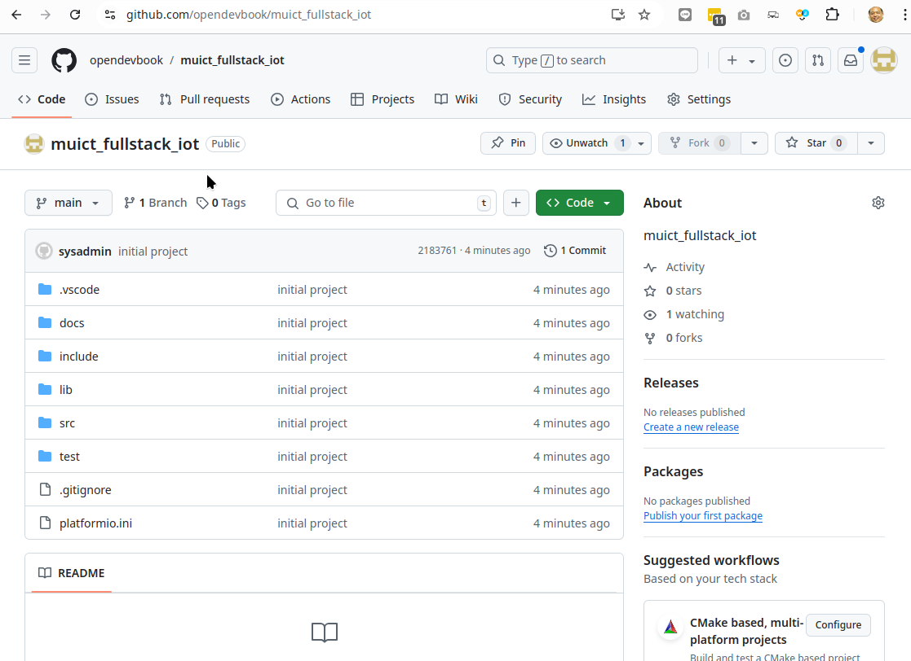

# Learn From Code

## 1 Clone example code from github



[https://github.com/opendevbook/muict_fullstack_iot](https://github.com/opendevbook/muict_fullstack_iot)

```bash title="clone repository"
git clone https://github.com/opendevbook/muict_fullstack_iot.git
```
