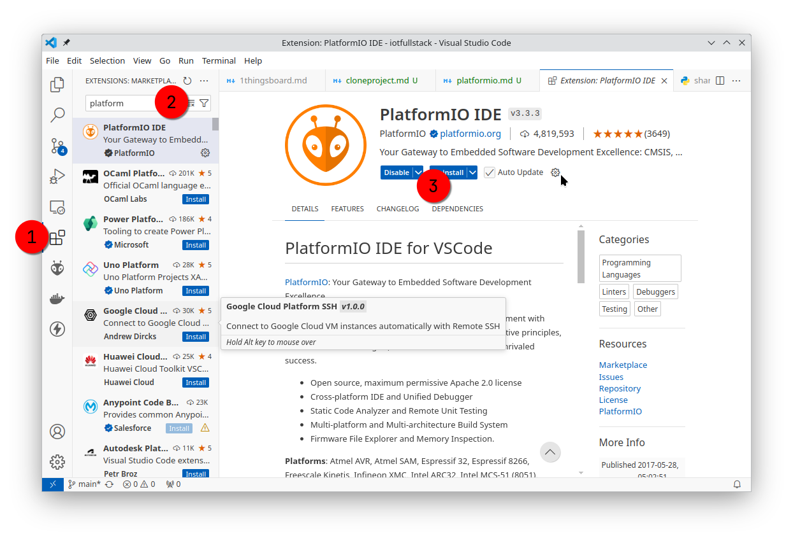
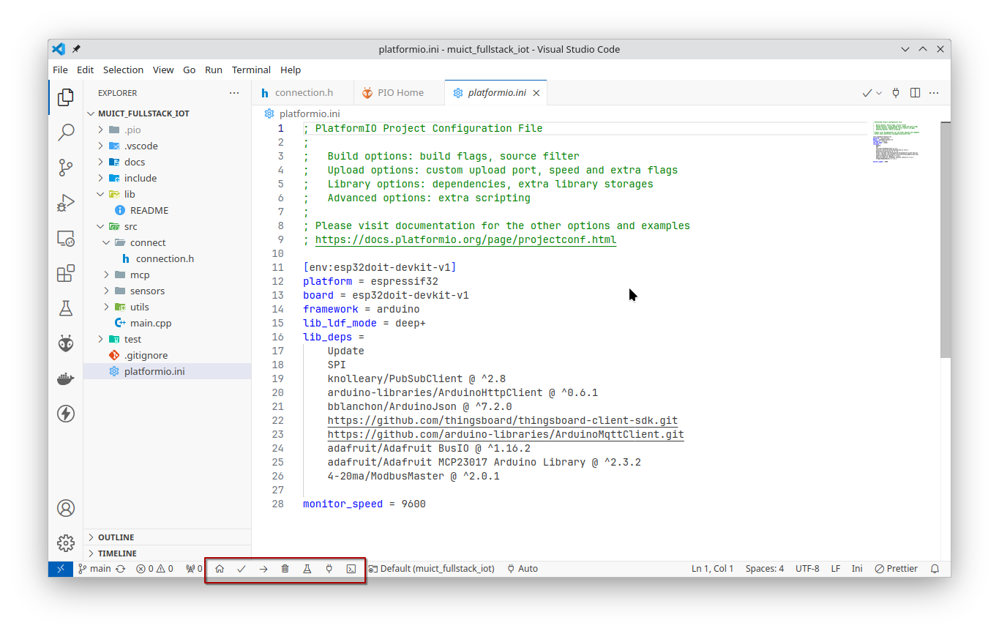
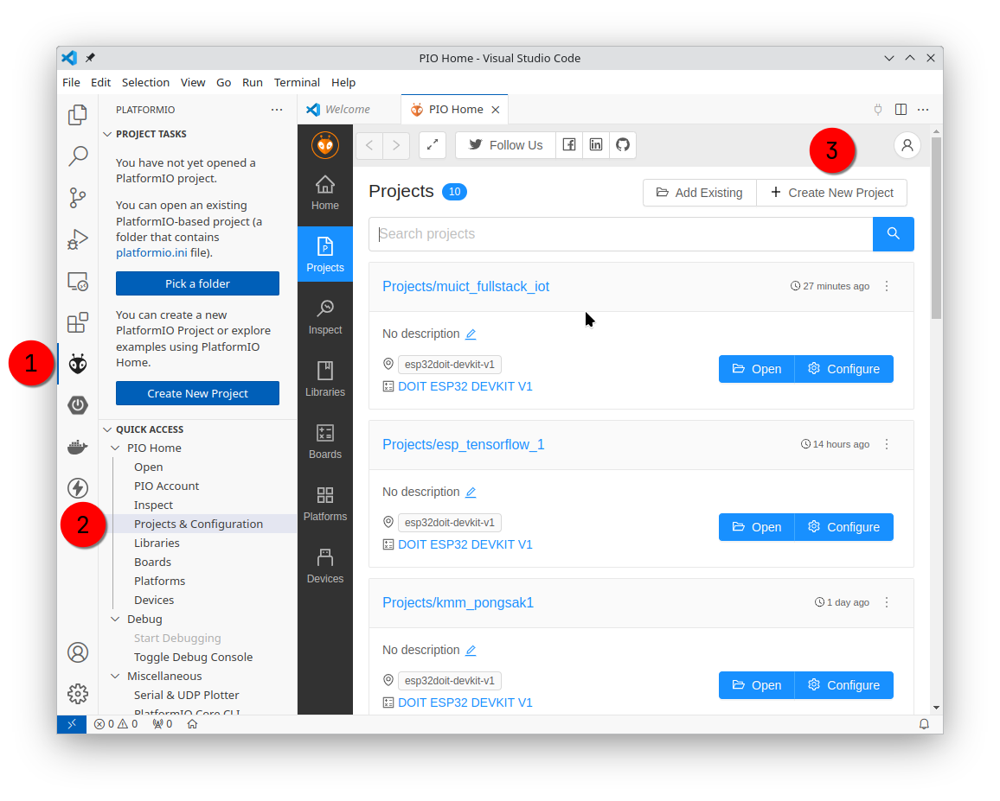
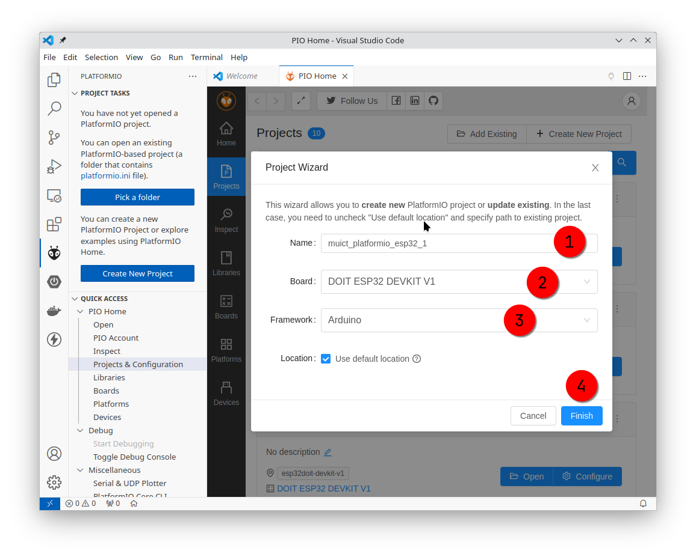
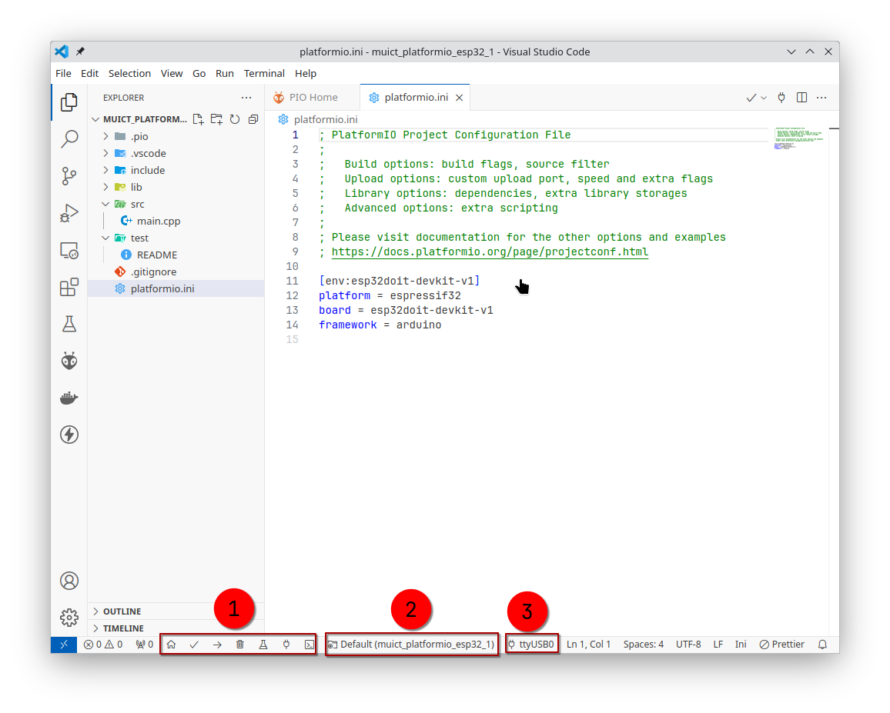

# Install platform io extenstion on Vscode

## 1 Install vscode [https://code.visualstudio.com/](https://code.visualstudio.com/)

1. Open VSCode Extension Manager
2. Search for official PlatformIO IDE extension
3. Install PlatformIO IDE.

## 2 Show menu buttom bar

## 3 Create Platform io project

- Project name : muict_platformio_esp32_1
  

- add project info
  

- Check menu
  
