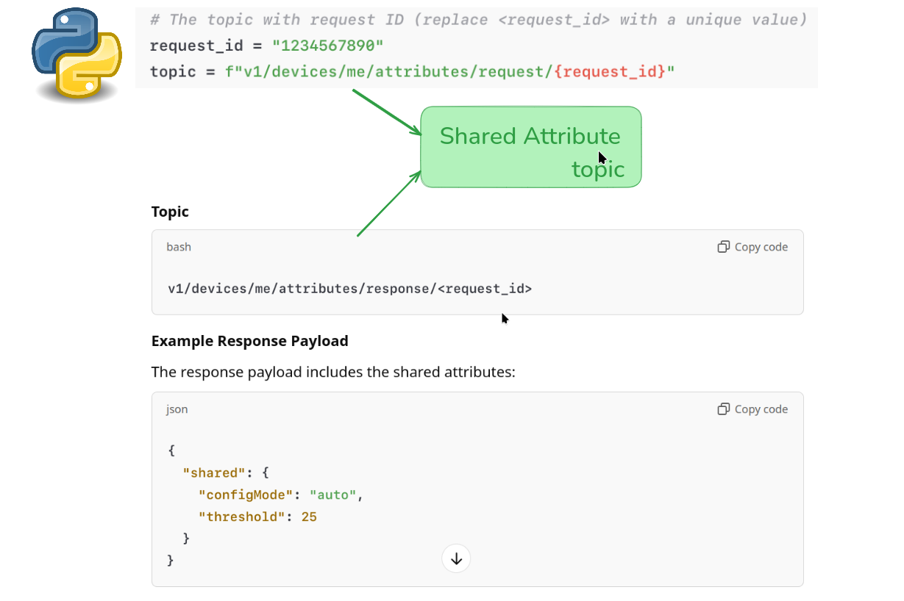

# Share Attributes in Thingsboard

## Summary: Shared Attribute Topic in ThingsBoard

**Objective of Shared Attributes:**

1. **Remote Configuration:** Configure devices remotely by sending key-value pairs from the server.
2. **State Synchronization:** Synchronize device behavior with server-defined parameters.
3. **Device Customization:** Dynamically adjust device operations based on server settings.
4. **Efficient Communication:** Reduce over-the-air updates by enabling flexible, dynamic configurations.

---

## Shared Attribute MQTT Topics

#### 1 Requesting Shared Attributes:

- Topic:

```bash
v1/devices/me/attributes/request/<request_id>
```

- Payload Example (empty to fetch all shared attributes):

```json
{}
```

#### 2 Receiving Responses:

**Topic:**

```bash
v1/devices/me/attributes/response/<request_id>
```

```json
{
  "shared": {
    "configMode": "auto",
    "threshold": 25
  }
}
```

## How It Works

1. Tenant defines shared attributes in ThingsBoard UI or via API.
2. Device requests shared attributes using the request topic.
3. Server responds with shared attributes on the response topic.

## Key Use Cases

1. Dynamic Threshold Updates: Devices fetch the latest threshold settings (e.g., for temperature).
2. Device Behavior Control: Devices retrieve shared attributes to modify functionality (e.g., controlling relays).
3. Periodic Configuration Fetching: Devices regularly fetch shared attributes to stay updated with current settings.

Example mqttcode:

```python
import paho.mqtt.client as mqtt
import json

# MQTT settings
broker = "thingsboard.cloud"
port = 1883
client_id = "your-client-id"
username = "your-username"
password = "your-password"

# The topic with request ID (replace <request_id> with a unique value)
request_id = "1234567890"
topic = f"v1/devices/me/attributes/request/{request_id}"

# MQTT Client setup
client = mqtt.Client(client_id)
client.username_pw_set(username, password)

# Connect to the ThingsBoard MQTT broker
client.connect(broker, port)

# Payload to request all shared attributes (empty object)
payload = {}

# Publish the request
client.publish(topic, json.dumps(payload))

# Loop forever to maintain connection and handle responses
client.loop_forever()
```


