# Add thingsboard

Discuss Overvies
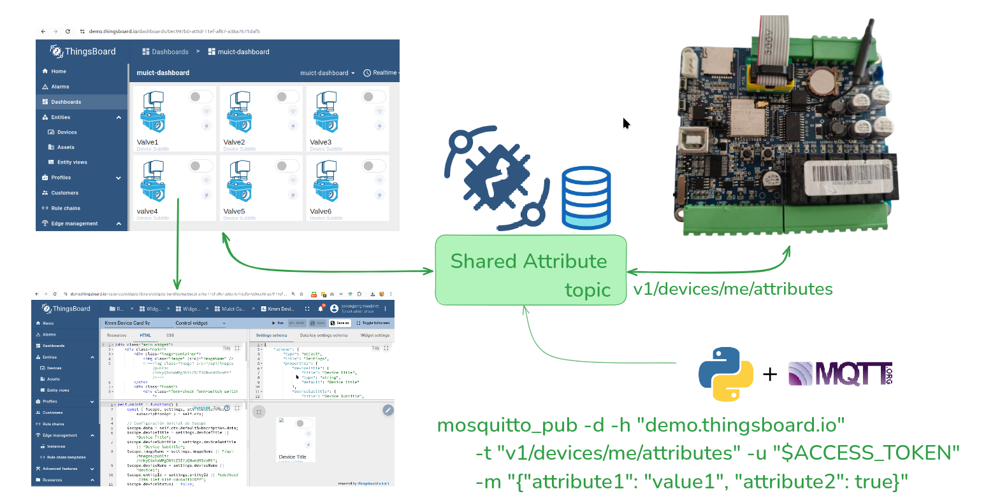

## Import Widget Bundle

**crate bundle**
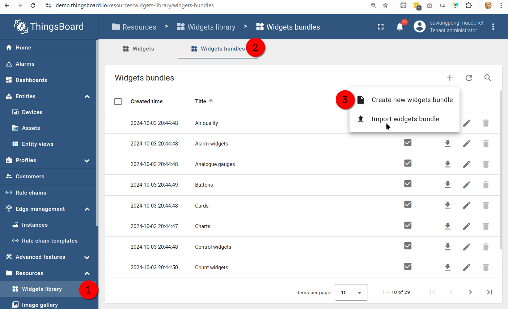

**add title of bundle:**
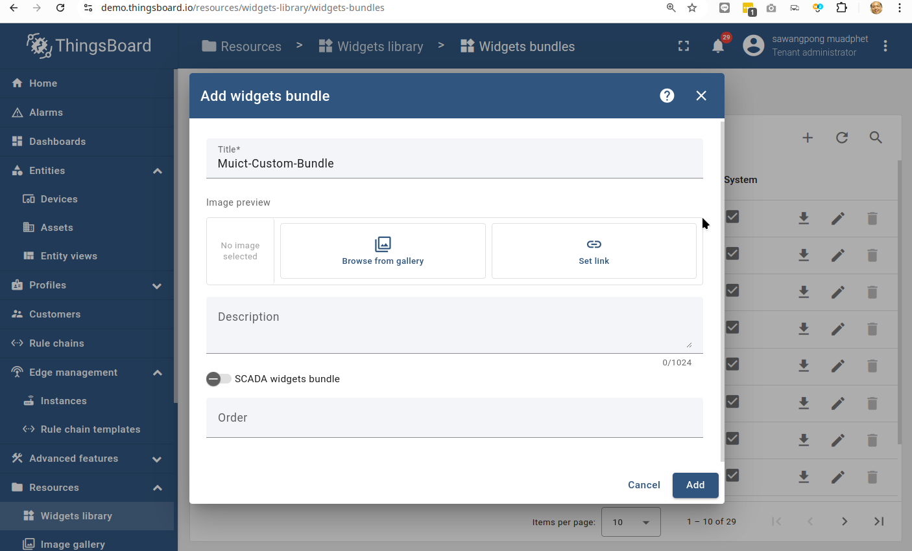

**import widget into bundle**

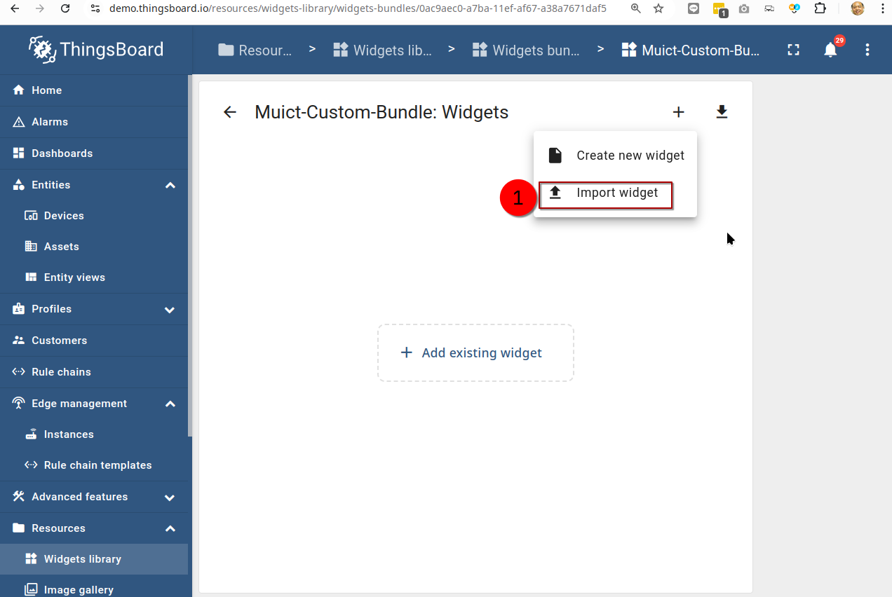

**Browse file (in json format)**

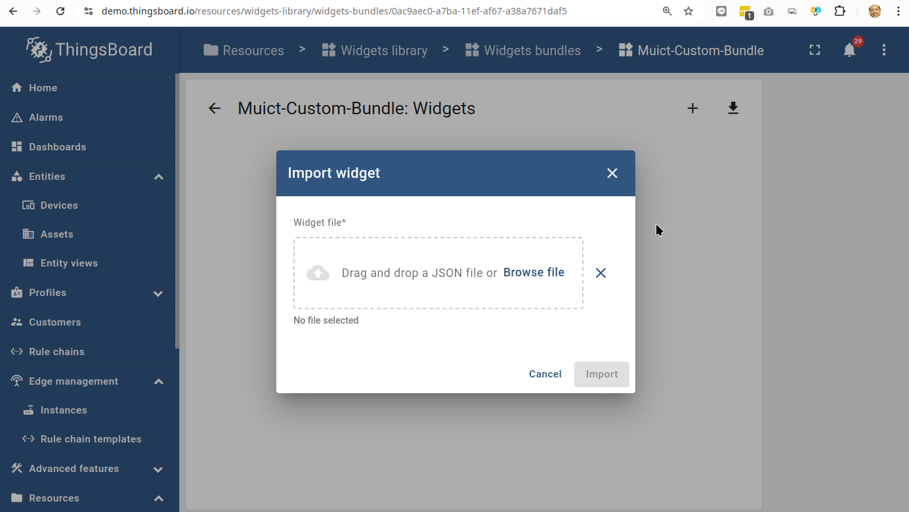

**Select widget**

**Import widget**

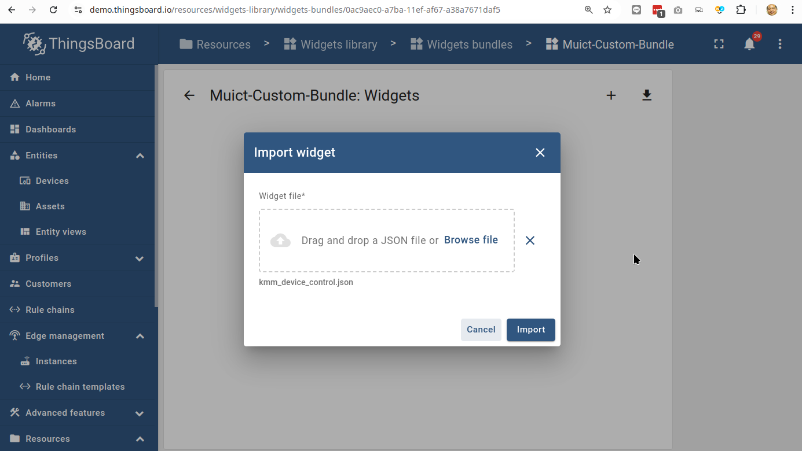

**Result import**

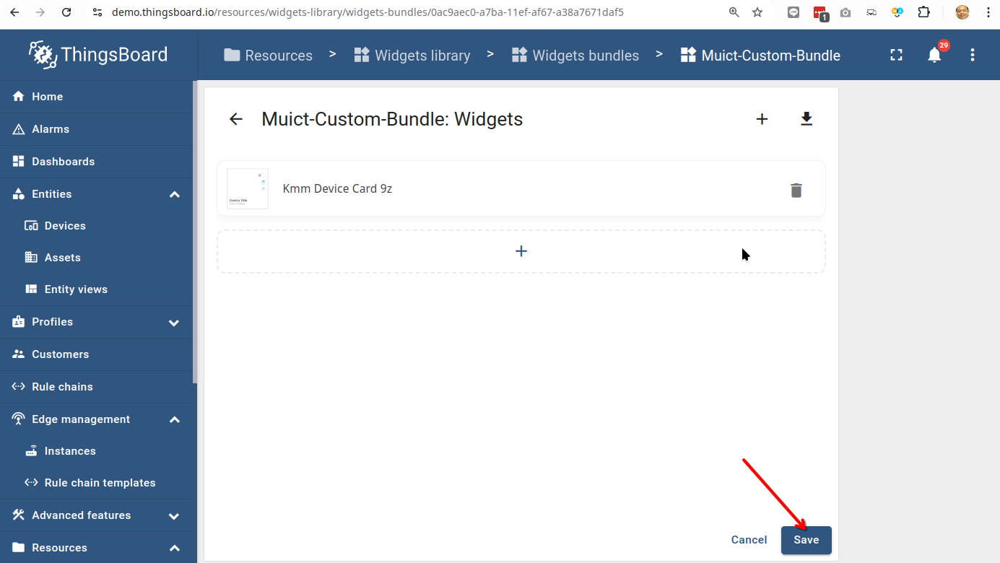

## Import image Asset

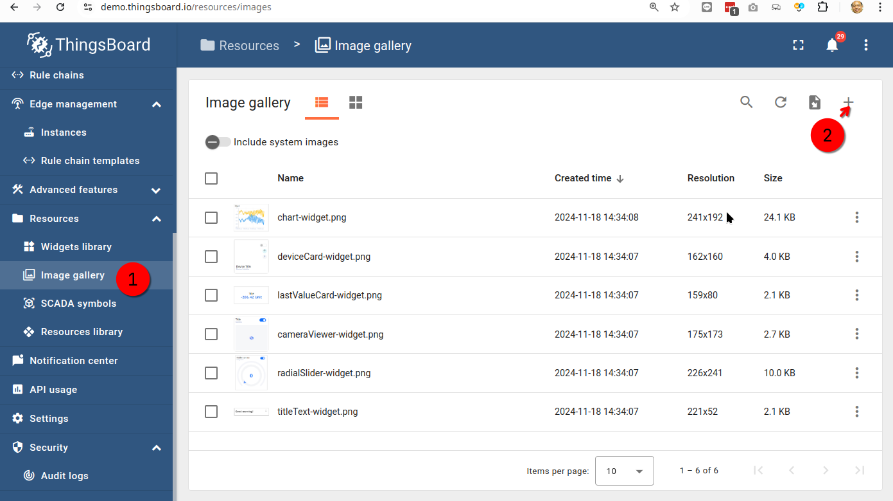

**Browse image**

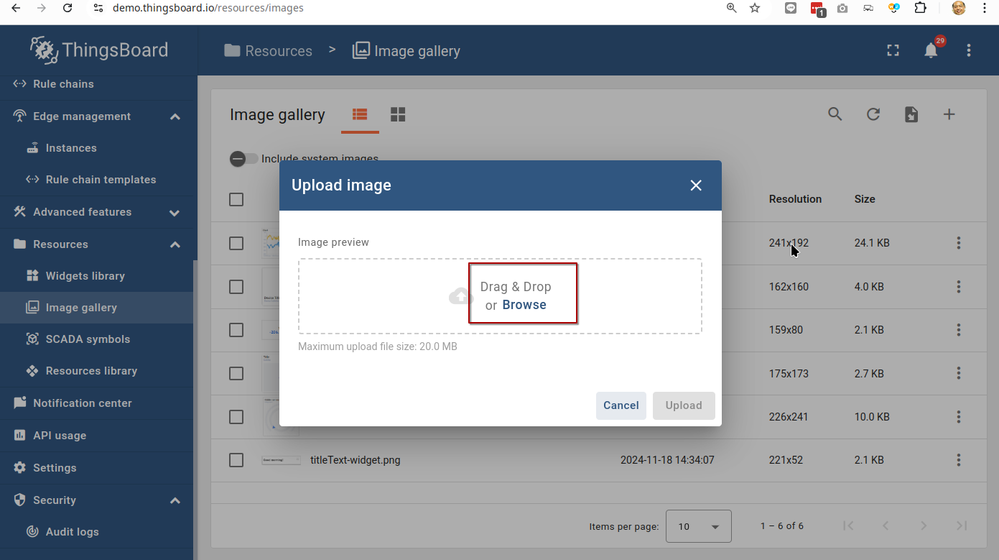

_Select image_

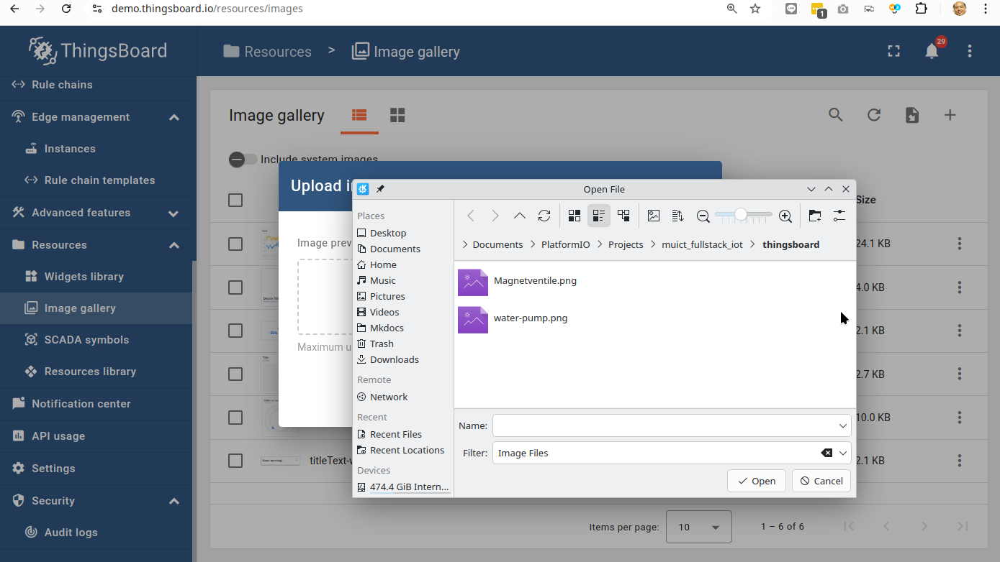

**Click upload**

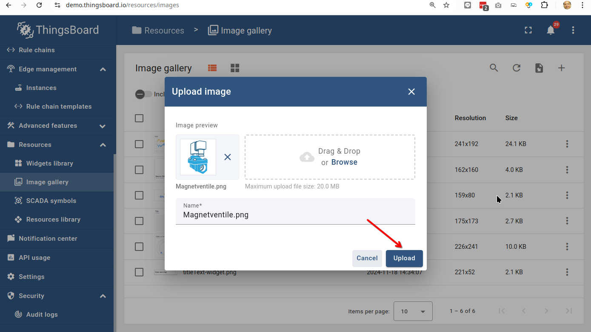

**Add more**

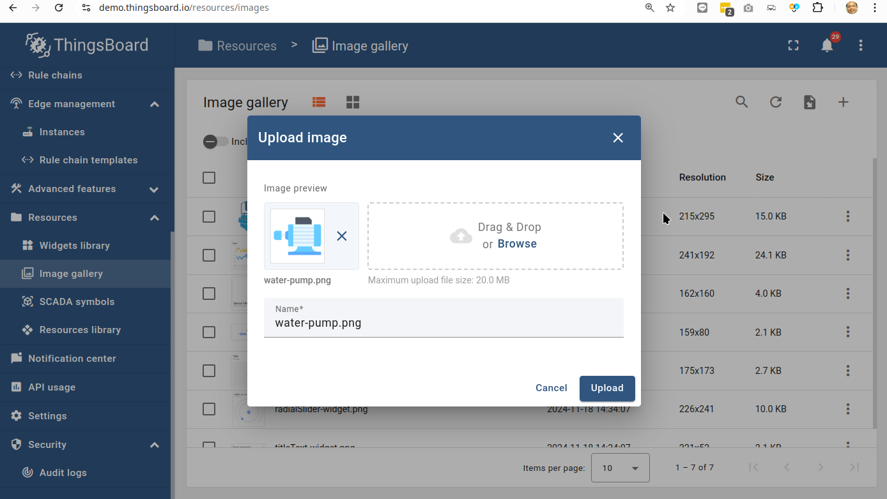

## Get Embeded link

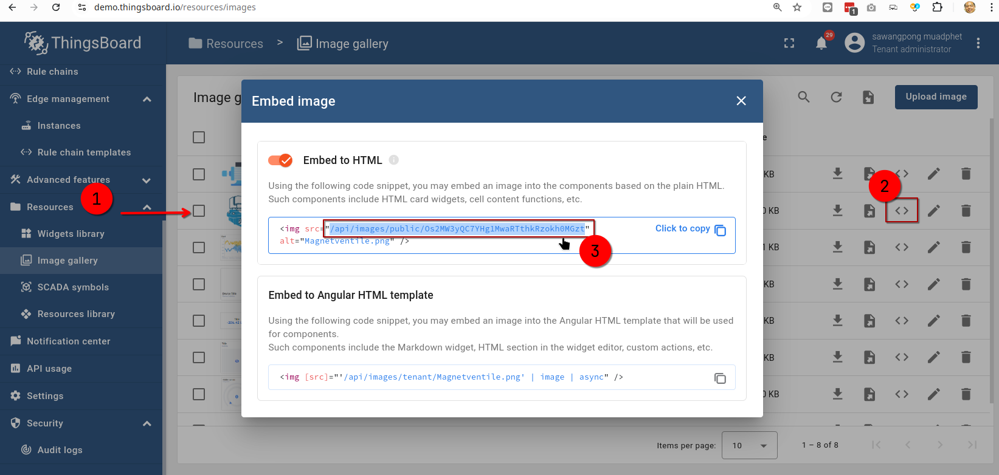

!!! note

    /api/images/public/Os2MW3yQC7YHg1MwaRTthkRzokh0MGzt

**Add Widget to Dashboard**

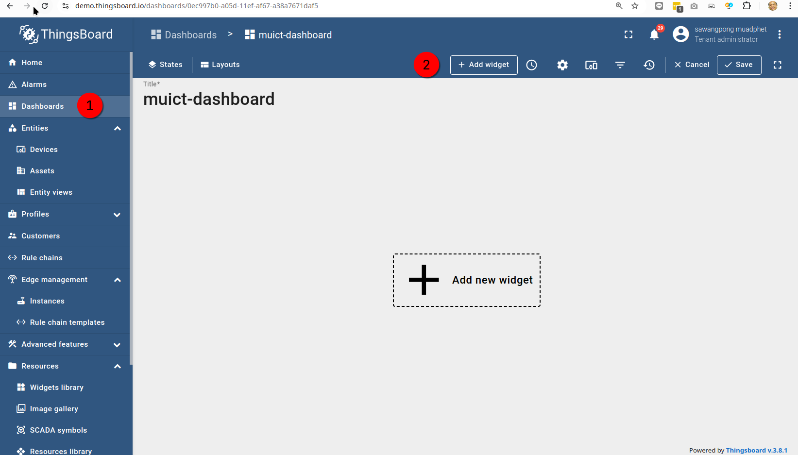

**Select your Bundle**

Select entity_id and copy

!!! note

    0cc97a60-a03b-11ef-af67-a38a7671daf5

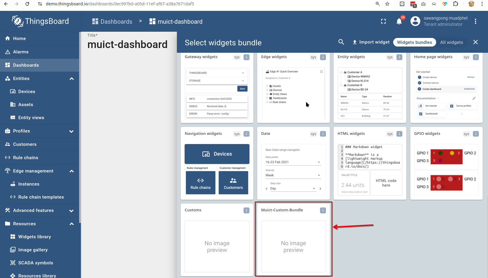

Select device widget

Selct device esp32

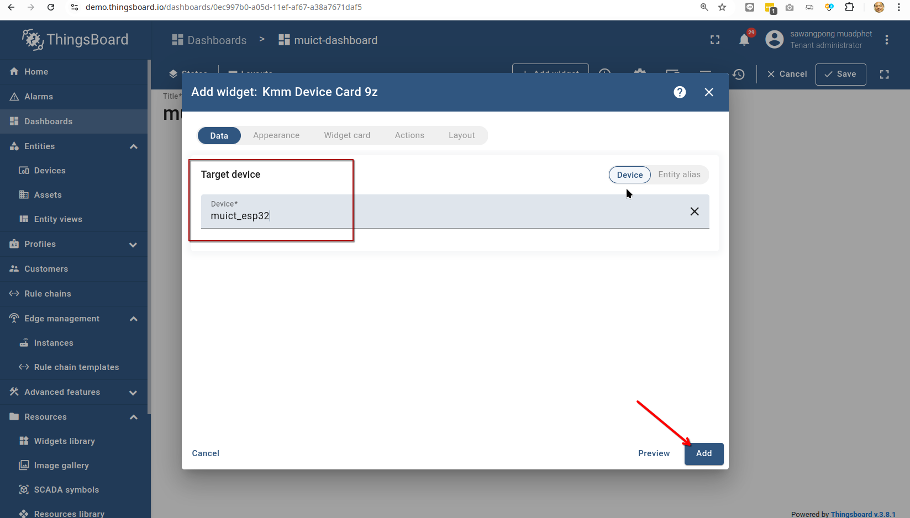

Add infomation

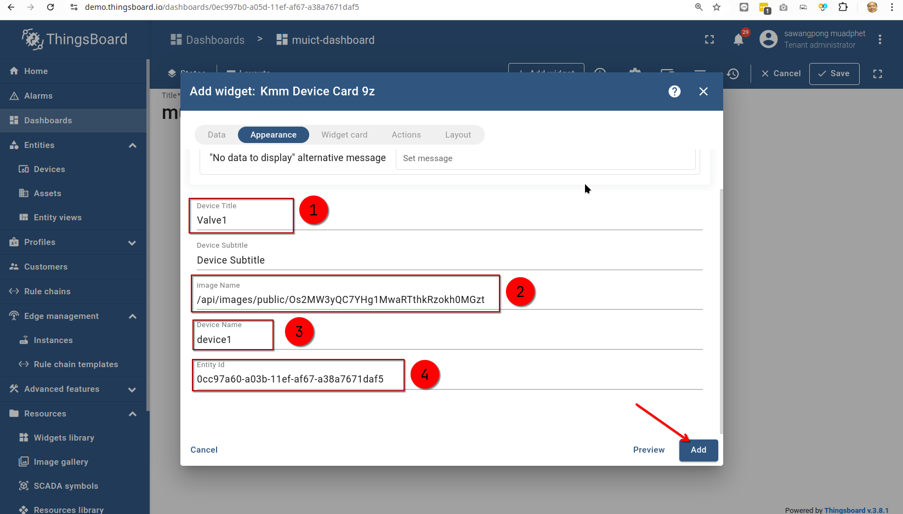

Save Dashboard
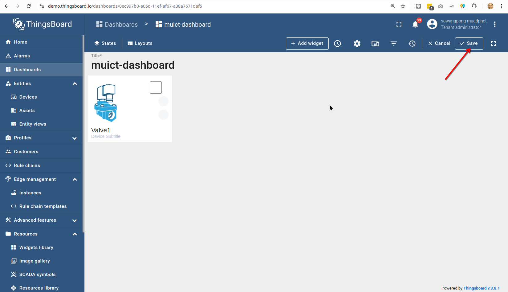
