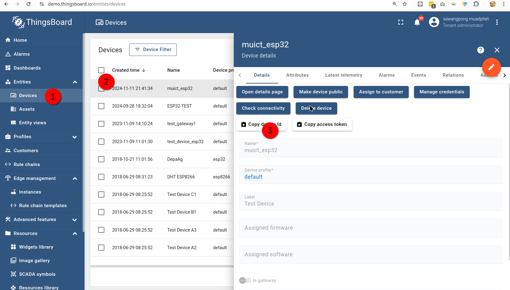

# Add thingsboard

Discuss Overvies

## Import Widget Bundle

**crate bundle**

**add title of bundle:**

**import widget into bundle**

**Browse file (in json format)**

**Select widget**

**Import widget**

**Result import**

## Import image Asset

**Browse image**

_Select image_

**Click upload**

**Add more**

## Get Embeded link

!!! note

    /api/images/public/Os2MW3yQC7YHg1MwaRTthkRzokh0MGzt

**Add Widget to Dashboard**

**Select your Bundle**

Select entity_id and copy

!!! note

    0cc97a60-a03b-11ef-af67-a38a7671daf5

Select device widget

Selct device esp32

Add infomation

Save Dashboard

