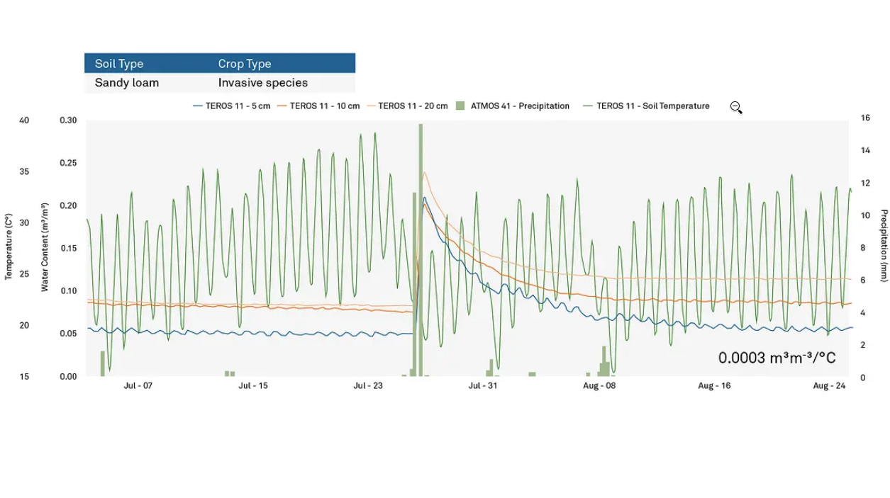
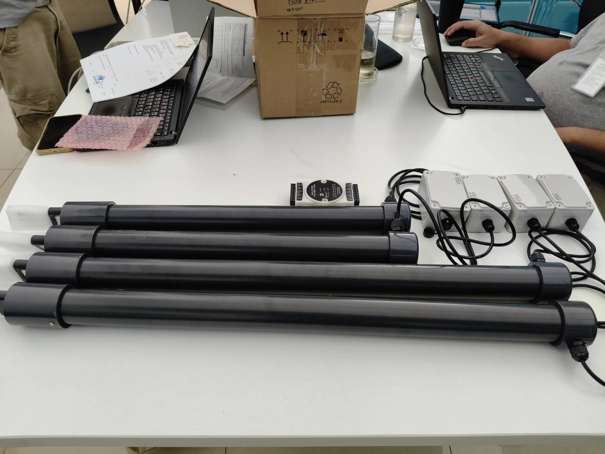
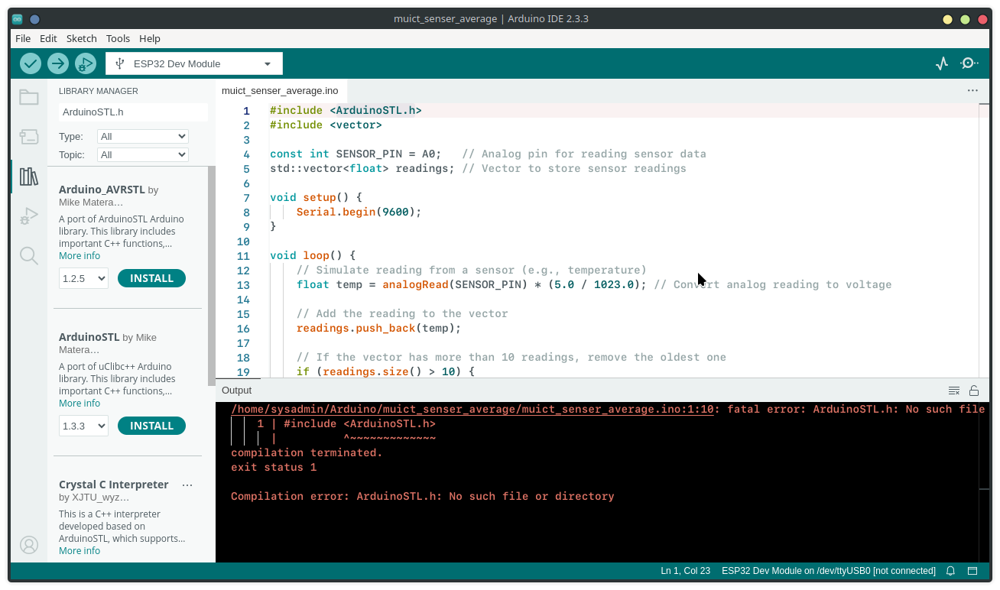
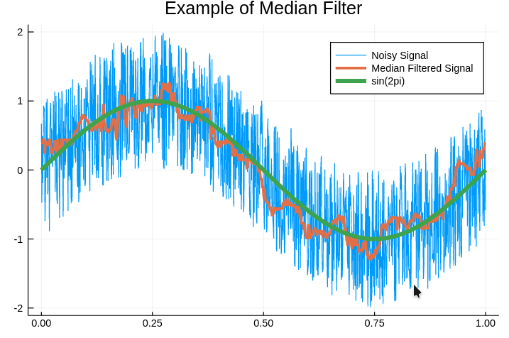

# Understand Sensor Data improvement





## 1 Use Case: Collecting and Averaging Sensor Readings

Suppose you have a temperature sensor connected to your Arduino. You want to take a series of readings, store them, and calculate the average whenever a new reading comes in. Using std::vector allows you to easily add, remove, or analyze readings without needing to resize a fixed-size array.

!!! note

    Filer data before save data to variable

Example: muict_senser_average

```cpp
#include <Arduino.h>
#include <vector>     //#include <ArduinoSTL.h> in arduino compatible

const int SENSOR_PIN = A0;   // Analog pin for reading sensor data
std::vector<float> readings; // Vector to store sensor readings

void setup() {
    Serial.begin(9600);
}

void loop() {
    // Simulate reading from a sensor (e.g., temperature)
    float temp = analogRead(SENSOR_PIN) * (5.0 / 1023.0); // Convert analog reading to voltage

    // Add the reading to the vector
    readings.push_back(temp);

    // If the vector has more than 10 readings, remove the oldest one
    if (readings.size() > 10) {
        readings.erase(readings.begin());
    }

    // Calculate the average of the readings
    float sum = 0;
    for (float value : readings) {
        sum += value;
    }
    float average = sum / readings.size();

    // Print the current temperature and average
    Serial.print("Current Reading: ");
    Serial.print(temp);
    Serial.print(" V, Average: ");
    Serial.print(average);
    Serial.println(" V");

    delay(1000); // Wait 1 second before next reading
}

```



## What is Mean filter and median filter

Mean filtering and median filtering are two related but distinct techniques often used in IoT for smoothing or processing sensor data to reduce noise:

1 Mean Filtering (Moving Average Filter):

Mean filtering is a type of moving average filter where you smooth out data by calculating the average of the most recent N readings.
It’s especially effective at reducing random noise and is easy to compute.
For example, if you’re measuring temperature and have readings [22.1, 21.8, 22.5, 22.3], a mean filter would calculate the average, yielding a smoothed-out value (e.g., 22.175).
This filter can lag behind rapid changes in data but is excellent for reducing small fluctuations.

2 Median Filtering (Median Smoothing):

- Median filtering is a nonlinear technique that’s effective for removing outliers or spikes in data, as it’s less influenced by extreme values.
- With this method, you sort your recent N readings and take the middle value (the median). For instance, with readings [22.1, 21.8, 50.5, 22.5, 22.3], sorting gives [21.8, 22.1, 22.3, 22.5, 50.5], and the median is 22.3.
- This is particularly helpful in IoT when sensors occasionally produce extreme readings due to interference or sudden, inaccurate spikes.

3 Comparison:

- Mean filter: Smooths gradual changes well but doesn’t handle sudden outliers effectively.
  Median filter: Better at removing spikes, making it suitable for applications where sensor readings can be erratic.

4 Application in IoT:

- Mean filtering: Often used for data with consistent noise patterns, such as smoothing temperature, humidity, or environmental data.
- Median filtering: Useful when data might be corrupted by sudden spikes, such as heart rate monitoring or motion detection, where abrupt false readings occur.

## Summary Filter for IoT

- Mean filtering: Ideal for smoothing consistent, low-noise signals.
- Median filtering: Best for handling occasional extreme values in data with outliers or spikes.

Both techniques enhance data quality, leading to more reliable IoT sensor readings and decisions. In practical IoT applications, the choice between mean and median filtering depends on your specific data characteristics and the nature of the noise or outliers you expect to encounter.



Example Code: Combining Median Filter, Mean Filter, and 5-Window Convolution

```cpp
#include <vector>
#include <algorithm>

const int SENSOR_PIN = A0;  // Analog pin for reading sensor data
const int WINDOW_SIZE = 5;  // 5-window period
std::vector<float> readings;  // Vector to store sensor readings
std::vector<float> weightedReadings;  // To store weighted readings for convolution

// Delay
const float wait_time = 200;  // 0.2 second wait time

// Function to calculate the median of a vector
float median(std::vector<float> &data) {
    std::sort(data.begin(), data.end());
    int size = data.size();
    if (size % 2 == 0) {
        return (data[size / 2 - 1] + data[size / 2]) / 2.0;
    } else {
        return data[size / 2];
    }
}

// Function to calculate the moving average (mean filter)
float mean(std::vector<float> &data) {
    float sum = 0;
    for (float val : data) {
        sum += val;
    }
    return sum / data.size();
}


void setup() {
    Serial.begin(9600);
}

void loop() {
    // Simulate reading from a sensor
    float sensorValue = analogRead(SENSOR_PIN) * (5.0 / 1023.0);  // Convert analog reading to voltage
    readings.push_back(sensorValue);  // Store sensor value in readings

    // Ensure the size of the readings vector does not exceed WINDOW_SIZE
    if (readings.size() > WINDOW_SIZE) {
        readings.erase(readings.begin());
    }

    // Apply Median Filter
    std::vector<float> filteredReadings = readings;  // Copy to apply median
    float medianFiltered = median(filteredReadings);

    // Apply Mean Filter on the filtered data
    float meanFiltered = mean(filteredReadings);

    // Print results
    Serial.print("Raw Sensor Value: ");
    Serial.print(sensorValue);
    Serial.print(" V, ");
    Serial.print("Median Filtered Value: ");
    Serial.print(medianFiltered);
    Serial.print(" V, ");
    Serial.print("Mean Filtered Value: ");
    Serial.print(meanFiltered);
    Serial.print(" V, ");


    // Wait for 0.2 seconds before next reading
    delay(wait_time);
}

```

## Use Convoltion Technic

To combine Median Filtering, Average Filtering (Mean), and a Convolution with a 5-window period while introducing a 0.2-second delay between each calculation in an IoT application, you need to structure your filter logic accordingly.

**Here's how you can approach this:**

1 Median Filtering: This will help remove outliers (spikes).  
2 Mean Filtering: This will smooth out the overall signal by averaging.  
3 Convolution with 5 Window Period: This is used to apply a weighted average across a moving window.  
4 0.2-second Wait: This will allow the system to take readings at intervals.
**Steps:**
1 Median Filter: Apply the median filter to remove spikes.  
2 Mean Filter: After the median, calculate the moving average (mean).  
3 5-Window Convolution: Implement a convolution that processes the average of 5 recent readings, applying weights if necessary.

Wait: Add a 0.2-second delay between readings.


Example: muict_sensor_convolute.ino

```cpp
#include <vector>
#include <algorithm>

const int SENSOR_PIN = A0;  // Analog pin for reading sensor data
const int WINDOW_SIZE = 5;  // 5-window period
std::vector<float> readings;  // Vector to store sensor readings
std::vector<float> weightedReadings;  // To store weighted readings for convolution

// Delay
const float wait_time = 200;  // 0.2 second wait time

// Function to calculate the median of a vector
float median(std::vector<float> &data) {
    std::sort(data.begin(), data.end());
    int size = data.size();
    if (size % 2 == 0) {
        return (data[size / 2 - 1] + data[size / 2]) / 2.0;
    } else {
        return data[size / 2];
    }
}

// Function to calculate the moving average (mean filter)
float mean(std::vector<float> &data) {
    float sum = 0;
    for (float val : data) {
        sum += val;
    }
    return sum / data.size();
}

// Function for 5-window convolution (simple moving average filter)
float convolution1(std::vector<float> &data) {
    // Simple moving average convolution with weights (equal weights)
    float sum = 0;
    for (float val : data) {
        sum += val;  // Equal weighting
    }
    return sum / data.size();  // Return the average over the window
}

float convolution2(std::vector<float> &data) {
    // Weighted moving average (example: more weight on the middle)
    float weights[] = {0.1, 0.2, 0.3, 0.2, 0.1};
    float sum = 0;
    for (int i = 0; i < data.size(); i++) {
        sum += data[i] * weights[i];  // Apply weight to each element
    }
    return sum;  // Return weighted sum
}

void setup() {
    Serial.begin(9600);
}

void loop() {
    // Simulate reading from a sensor
    float sensorValue = analogRead(SENSOR_PIN) * (5.0 / 1023.0);  // Convert analog reading to voltage
    readings.push_back(sensorValue);  // Store sensor value in readings

    // Ensure the size of the readings vector does not exceed WINDOW_SIZE
    if (readings.size() > WINDOW_SIZE) {
        readings.erase(readings.begin());
    }

    // Apply Median Filter
    std::vector<float> filteredReadings = readings;  // Copy to apply median
    float medianFiltered = median(filteredReadings);

    // Apply Mean Filter on the filtered data
    float meanFiltered = mean(filteredReadings);

    // Apply Convolution Filter (5-window period)
    // Try function  convolution2
    float convolutionFiltered = convolution1(filteredReadings);

    // Print results
    Serial.print("Raw Sensor Value: ");
    Serial.print(sensorValue);
    Serial.print(" V, ");
    Serial.print("Median Filtered Value: ");
    Serial.print(medianFiltered);
    Serial.print(" V, ");
    Serial.print("Mean Filtered Value: ");
    Serial.print(meanFiltered);
    Serial.print(" V, ");
    Serial.print("Convolution Filtered Value: ");
    Serial.print(convolutionFiltered);
    Serial.println(" V");

    // Wait for 0.2 seconds before next reading
    delay(wait_time);
}
```

## Customize and understand weigted

!!! note

    Custom weight

This is an example of a 5-point weighted moving average. Let’s break down why these specific weights might be chosen:

**part1** 0.1 at the ends (weights[0] and weights[4]):

- The outermost values (older values in the window) get the smallest weight because they are assumed to be less relevant for predicting or smoothing the current trend. The older data might not reflect current sensor conditions as closely as the more recent data.

**part2** 0.2 for the second and fourth values (weights[1] and weights[3]):

- These are the next most recent data points, and they are still important, but slightly less so than the center. By giving them a weight of 0.2, we give them more importance than the older readings, but less than the most recent one.

**part3** 0.3 at the center (weights[2]):

- The central value (the third element in the window) is considered the most important since it represents the most recent reading in the dataset. This value is given the highest weight (0.3) because it is assumed to be the most relevant for understanding the current state of the system.
