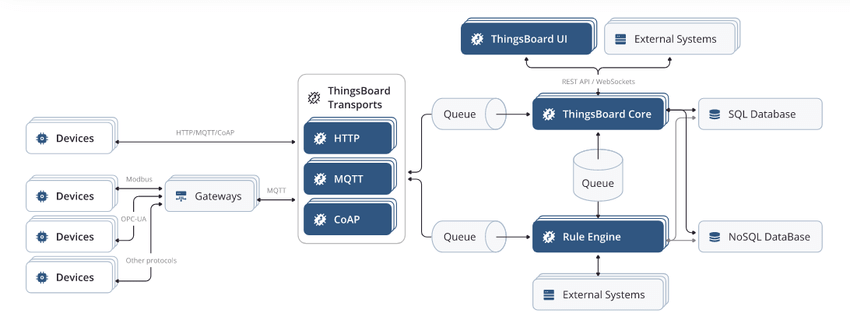
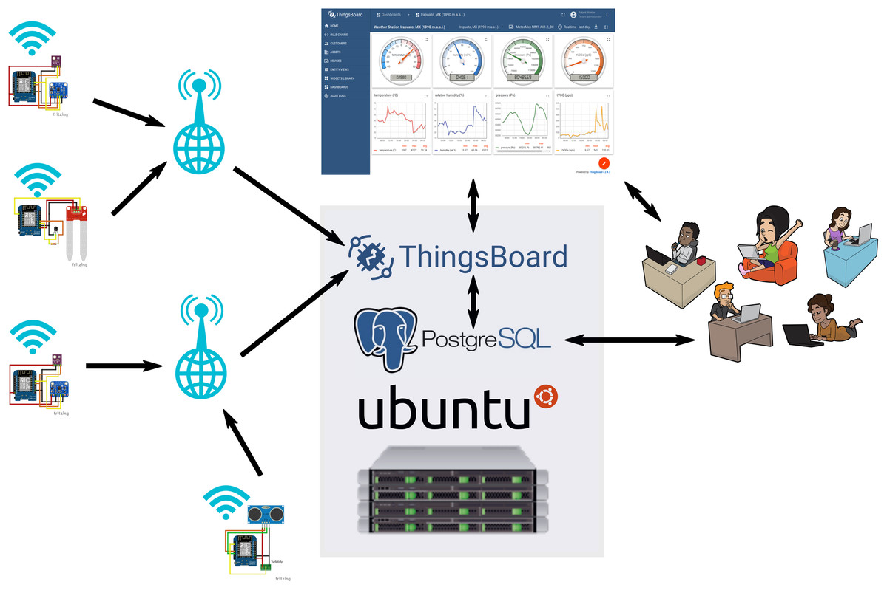

# Overview thingsbaord

- Devices represent the range of various types of IoT devices which can be connected to ThingsBoard such as, thermostats, sensors, gps trackers, etc.
- ThingsBoard Transport microservices is the collection of transport servers which responsible for transporting the data from the IoT device to the ThingsBoard Core. This includes the HTTP 2, MQTT 3 and CoAP 4 servers.
- ThingsBoard Core microservices consists of core node(s) responsible for handling REST API calls, websocket subscriptions, process messages from devices via Rule Engine and monitor connectivity state of the devices.
- ThingsBoard Rule Engine microservices include configurable chain of rules that are used to process incoming messages from the devices. They also include JavaScript Executor Microservices which allows users to add custom JavaScript functions to process incoming data.
- ThingsBoard Web UI allows users to interact with the system by letting them visualize the devices data and configure the rule engine.
- Things-Party systems entails databases (Cassandra, PostgreSQL), queuing software (Apache Kafka), data structure storage for caching (Redis) and distribution coordination servers (ZooKeeper).5 A more in-depth analysis of these components can be found in one of our previous essays titled ‘ThingsBoard - Architecture’.6

