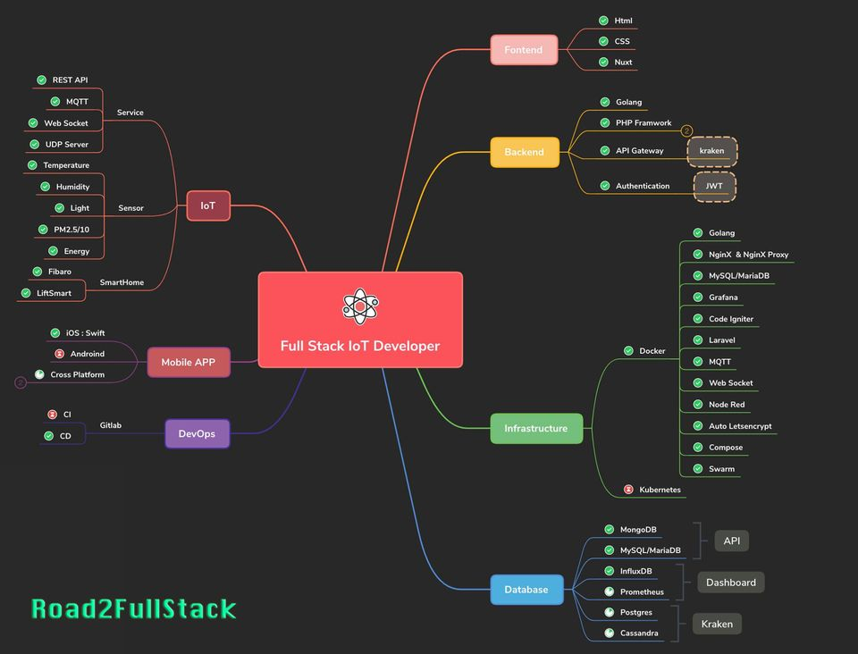
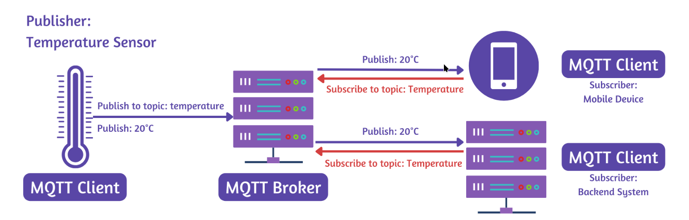
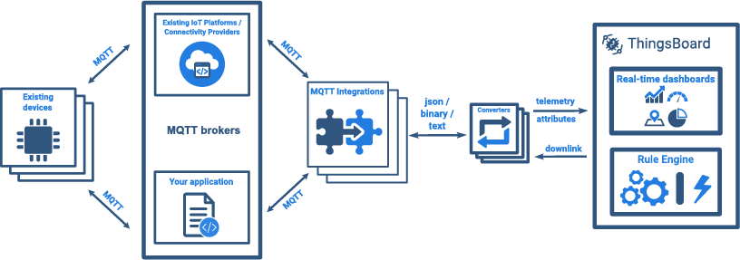

# Full Stack IoT Development

# Overview thingsbaord

- Devices represent the range of various types of IoT devices which can be connected to ThingsBoard such as, thermostats, sensors, gps trackers, etc.
- ThingsBoard Transport microservices is the collection of transport servers which responsible for transporting the data from the IoT device to the ThingsBoard Core. This includes the HTTP 2, MQTT 3 and CoAP 4 servers.
- ThingsBoard Core microservices consists of core node(s) responsible for handling REST API calls, websocket subscriptions, process messages from devices via Rule Engine and monitor connectivity state of the devices.
- ThingsBoard Rule Engine microservices include configurable chain of rules that are used to process incoming messages from the devices. They also include JavaScript Executor Microservices which allows users to add custom JavaScript functions to process incoming data.
- ThingsBoard Web UI allows users to interact with the system by letting them visualize the devices data and configure the rule engine.
- Things-Party systems entails databases (Cassandra, PostgreSQL), queuing software (Apache Kafka), data structure storage for caching (Redis) and distribution coordination servers (ZooKeeper).5 A more in-depth analysis of these components can be found in one of our previous essays titled ‘ThingsBoard - Architecture’.6

## Under MQTT protocol

MQTT (Message Queuing Telemetry Transport) is a lightweight messaging protocol widely used in IoT (Internet of Things) for efficient communication between devices, especially in scenarios with limited bandwidth or unstable networks. Designed for high latency and low bandwidth environments, MQTT enables fast, reliable, and real-time data exchange between IoT devices, such as sensors, actuators, and control systems, with a centralized broker that manages message distribution.

The Thingsboard server system functions as a MQTT broker and provides support for QoS levels 0 and 1

**Key Concepts in MQTT for IoT:**

**1 Broker-Based Model:**  
MQTT uses a publish-subscribe model facilitated by a broker (such as Mosquitto or HiveMQ). IoT devices (clients) publish messages to specific topics, and other devices or systems subscribe to these topics to receive the data. This structure reduces direct device-to-device connections and centralizes data management.

**2 Topics and Messages:**  
Topics are hierarchical labels that organize data streams (e.g., sensor/temperature/room1). Devices publish messages to topics, and subscribers receive messages for topics they are interested in, allowing fine-grained control of data flows.

**3 Quality of Service (QoS):**  
MQTT offers three QoS levels:

- QoS 0: "At most once" – message delivery is not guaranteed.
- QoS 1: "At least once" – message delivery is guaranteed but may be duplicated.
- QoS 2: "Exactly once" – message delivery is assured only once.

**4 Lightweight Protocol:**  
MQTT has minimal packet headers and supports small data payloads, making it suitable for resource-constrained devices and networks.

**5 Retained Messages:**  
MQTT allows the last message published to a topic to be retained, so new subscribers receive the most recent state data immediately upon subscribing.

**6 Last Will and Testament (LWT):**  
This feature allows devices to define a message sent by the broker if they unexpectedly disconnect, enabling reliable monitoring of device health.

Thingsboard integration diagram:

**Topic 1 Getting Started on ThingsBoard**

    - Introduction to ThingsBoard
    - Installing ThingsBoard on Local Servers
    - Sign Up ThingsBoard Cloud
    - ThingsBoard Use Cases

**Topic 2 Connect Devices to ThingsBoard**

    - Entities & Assets
    - Connect Devices to ThingsBoard
    - Upload Telemetry Data

**Topic 3 Send Data via MQTT and HTTP**

    - Overview of MQTT
    - Send Data via ThingsBoard MQTT and Node-Red
    - Overview of REST HTTP
    - Send Data via ThingsBoard HTTP and Node-Red
    - Install Thingsboard library in Arduino IDE
    - Send Data via Arduino IDE

**Topic 4 Data Visualization**

    - Dashboard
    - Widgets
    - Display Telemetry Data on Dashboard

**Topic 5 Setup Rules and Triggers**

    - Setup Rule Chain
    - Setup Alarm Trigger
